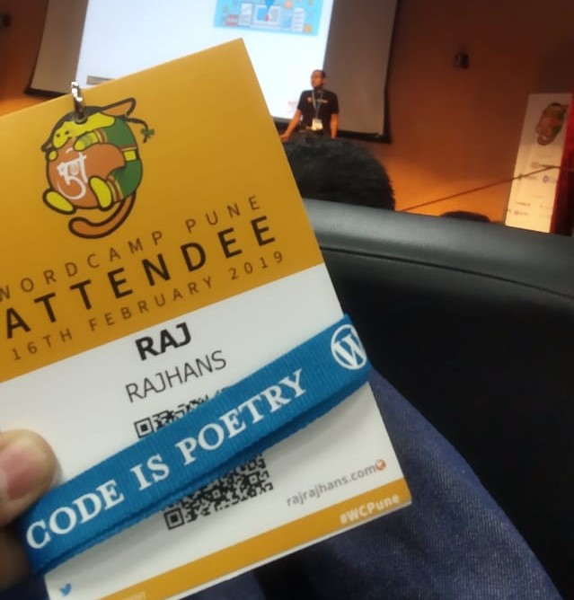
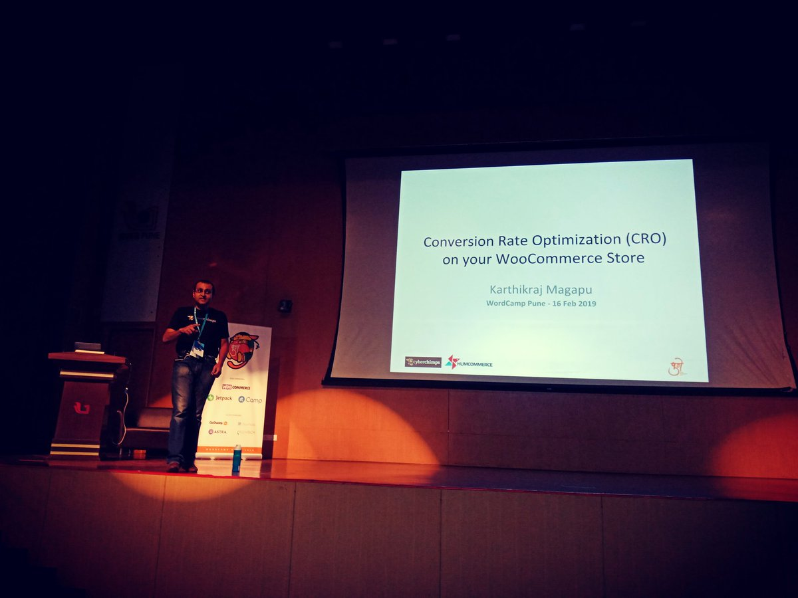
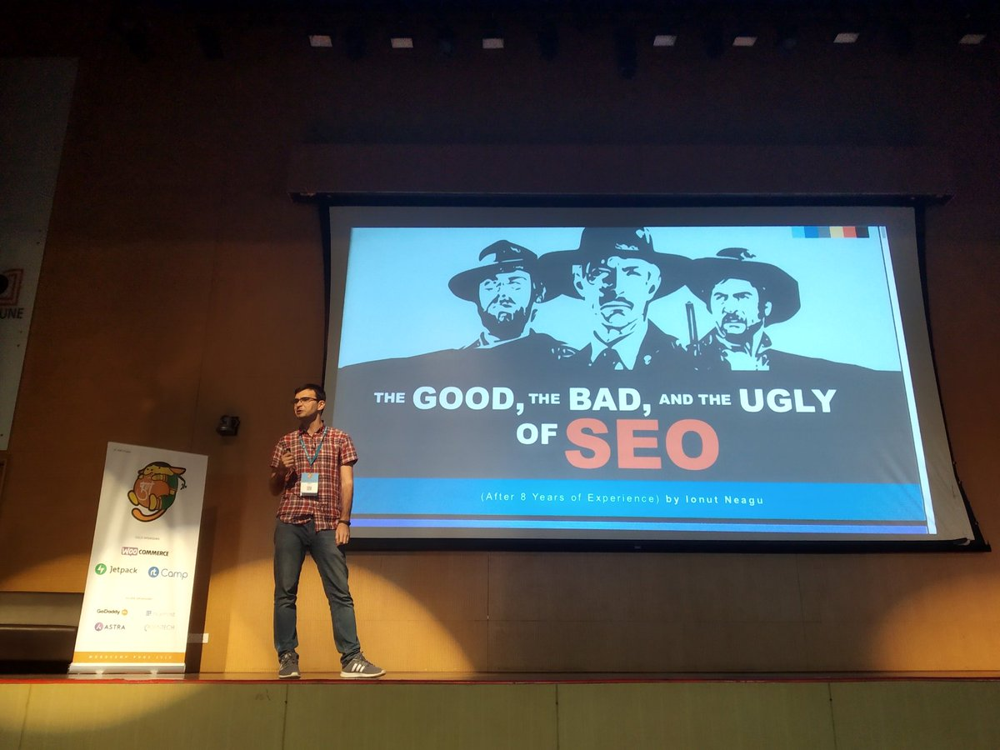
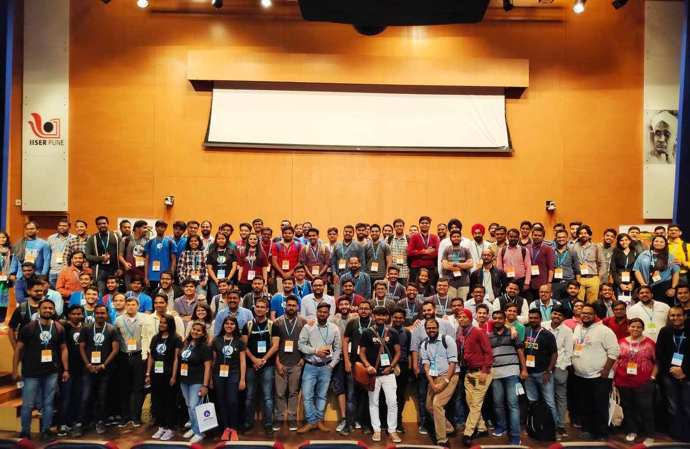

Exactly a week ago, I attended my first WordCamp at Pune. I’ve been working with WordPress for quite a while now, but wasn’t aware of such a community of developers exists in Pune. Well, I’m definitely glad that I got to know about it. For those who are not acquainted with WordCamps, a WordCamp is a conference that focuses on everything WordPress. WordCamps are informal, community-organized events that are put together by WordPress users like you. Everyone from casual users to core developers participate, share ideas, and get to know each other.

So exactly a week ago, on 16th February 2019, Saturday, WordCamp 2019 took place at the sprawling campus of IISER Pune. As we entered the capacious C.V. Raman Auditorium of IISER Pune, we were greeted by the volunteers by the registration desks who handed us the marvelous merchandise – our ID, a bag with goodies like coffee mug and laptop stickers inside. Then there was the delectable breakfast!

There were really informative sessions lined up by noteworthy speakers., Md. Anam Hossain spoke about WordPress Plugin Development from Scratch with ReactJS.Karthikraj Magapu delivered a really interesting and excellent session on Conversion Rate Optimization (CRO) on WP ecommerce sites. These engaging yet informational sessions were followed by lunch. During lunch, I had a chance to meet new people, catch up with old buddies, etc.

Ionut Neagu conducted a session on “The Good, The Bad and The Ugly of SEO”, which I personally useful since I was looking for improving the SEO of my website. He followed up his presentation by taking questions from the audience, which made the session really engaging.

If you want to know more about the speaker lineup, head over to https://2019.pune.wordcamp.org/

There were many companies “camping” at the event. They gave out amazing swags (trust me, the swags were le-gen-dary), and exclusive offers for their products for us devs. I had a great time interacting with employees from companies like rtCamp, AsenTech, WooCommerce, JetPack, Astra. They gave us insights about their company, there also was a job board for people who were looking for employment opportunities.

I had a lot of fun at WordCamp Pune 2019, whether we were taking pictures, chatting on the WordPress Katta, or during the beer pong at the After Party, WC Pune 2019 was surely a day to remember! I look forward to attending more WordCamps, and you should, too!

