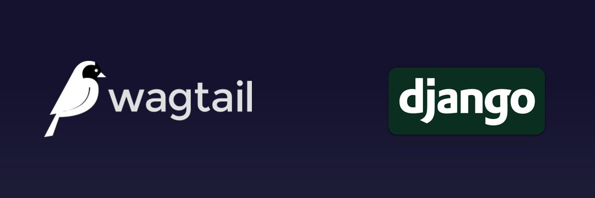

If you have ever heard of a content management system (CMS) you have likely heard of WordPress. A CMS, to put simply, is a piece of software used to create and manage digital content, meaning, websites. WordPress is a very popular and easy to use CMS solution, and as of 2016, 76.5 million blog sites are powered by WordPress. In fact, even this site is powered by WordPress (although I am planning to move from WordPress, more on that later). WordPress is user friendly, it has a large community, and there is a plugin for everything you want to do. However, there may be situations where you don’t want to use WordPress as your CMS solution. WordPress isn’t the best when it comes to performance, or security, for that matter. Or, maybe, your IT infrastructure does not fully support WordPress, which is what happened in my case.

The IT infrastructure of the company I worked for wanted a blog solution for was based on Heroku. Heroku has a ephemeral file system (), meaning any files generated dynamically get erased on restarting the dyno. Also, Heroku doesn’t provide MySQL (You have to use PostgreSQL). There is a workaround to get WordPress working on Heroku but it involves a number of third party plugins, using a external storage for images, disabling auto updates, etc. All this is leaves many vulnerabilities, so I decided against it.

So, after trying and testing numerous CMS <ExtLink link="https://wagtail.io/"> Wagtail </ExtLink> was my pick of the bunch. Wagtail is based on Django, which is a plus point in my diary. When you need an app that can grow in depth and complexity to any scale, Django shines. Also, being Django-based, I can customize it any way I see fit. Wagtail is free and open-source. Let’s discuss some features of Wagtail before actually implementing Wagtail on a Heroku dyno.

The Wagtail CMS was designed to be simple and fast, and all of that was achieved by separating responsibilities between the programmer and content manager. This separation means that a content manager can’t create any new entity in the system using the admin panel interface without it being predefined in code. In other words, before using a page or a block of content in the admin panel, it must be created programmatically first.

The Wagtail interface is very simple and straightforward with minimal settings. All the settings and functionality has to be implemented in code first. For example, in Wagtail, pages are Django models. So, before using a “block”, it has to be implemented as a Python class in Django first. Because of this, Wagtail requires a certain expertise in Python and Django and seems complex at first than it really is. But this is at the cost of flexibility in development. Wagtail only provides a platform and a set of tools which give full freedom to the programmer on how and where to use them. If you were to change or tweak some of WordPress’s core functionality, it would be very difficult and complex to do so, as most probably there would be other things like plugins which would be dependent on that.

One more thing to add, Wagtail can also be used as a headless CMS. A headless CMS is a CMS which has no Head (for real :p), meaning it does not have a front end to display the content. Then what is the point, you ask? Well, a headless CMS has a API that gives the output (posts, pages, etc) as JSON data. So, it can be easily integrated with existing codebase. Let’s take an example. Suppose you have a application and want to display blogs on that application, as well as your website. So, instead of repeating the content on every platform, you set up a headless CMS which sends data in JSON to both the website and app, and then they both display the data accordingly.

So, to summarize, here are the pros of using Wagtail as a CMS solution –
1. Clean, simple and straightforward interface.
2. Clear separation between content manager and developer.
3. Flexibility in development.
4. Easy and speedy development because Wagtail is based on Django and uses Django’s authentication backend, templating system, etc.
5. Can be used as a headless CMS.

I would say these are the cons of using Wagtail –
1. There is no front end out of the box.
2. Installation and set up is a bit complicated.
3. You need to have some experience in Django to get the most of Wagtail.

Wagtail is not an instant website in a box. You can’t make a pretty website by plugging ready-made modules together. Unlike WordPress, writing code is required. This can be a pro for some, or a con for some. Personally, I see it as a pro, as it offers the kind of flexibility that WordPress never can.Setting up and deploying Wagtail is pretty easy, just follow their <ExtLink link={"https://docs.wagtail.io/en/v2.5.1/"}>documentation</ExtLink>. So that is it for this post. See you next time!

