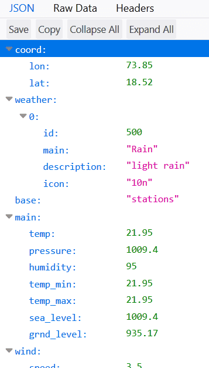
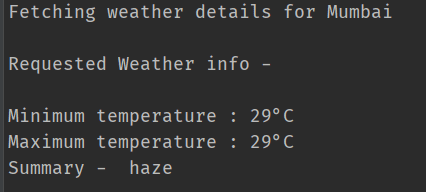
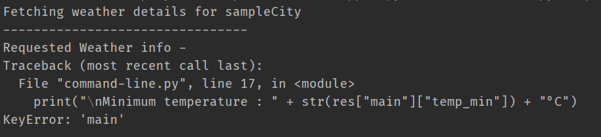
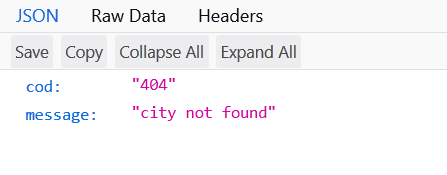
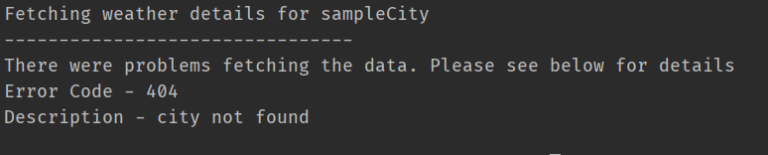

*dusts off shoulders*

So it’s been some time since I have done this. But I have planned to blog more often and get a series of 4-5 posts up, which consists of a project that started as a simple command line application and then developed into a full blown web app. I think it would be very good starting point for beginners, and I can assure you that I learned a lot from this. Anyways, let’s get started. Today, we will make a simple command line based Python application that displays the weather of a particular city, which is not more than 30 lines of code but will illustrate making requests in Python, using an API and parsing JSON to extract required data.

For this, we are going to use an API that provides us the data that we need. Think of API’s as a means of providing data. Your application is like a microwave oven. But it needs electricity, right? You can make your own electricity, but that would require solar panels or wind mills and whole other equipment. So you take the electricity from the electric company. How does your oven get the electricity from the electric company? Well, through the socket. The socket is equivalent to an API. Your oven has a plug that fits into the socket to get the electricity it needs. Similarly, our application “requests” the “API” for the “data” it needs. Get it?

We will use the OpenWeatherMap API for getting the weather data. It offers 60 API calls per minute for free, and is fast. You have to register an account on the OpenWeatherMap website after which you will be provided with the API key.

Now the endpoint for OpenWeatherMap API is http://api.openweathermap.org/data/2.5/weather?q=. So, for example if you wanted the weather data for Pune, India, you would send a GET request to api.openweathermap.org/data/2.5/weather?q=Pune,IN&APPID=your_app_id, where you will put your app id. For testing, you can try <ExtLink link="https://samples.openweathermap.org/data/2.5/weather?q=London,uk&appid=b6907d289e10d714a6e88b30761fae22"> https://samples.openweathermap.org/data/2.5/weather?q=London,uk&appid=b6907d289e10d714a6e88b30761fae22 </ExtLink>. The server will return a JSON with our required data.

As you can see, the temperature data is in Kelvin units. So, to get the data in Metric units, we shall add ‘&units=metric’ to our request URL. Now, this is what it looks like –



Now, taking this all into consideration, we shall write the code. We will use requests library for sending a GET request to the API. The response received will first have to be parsed as JSON. We do that by using response.json() which returns a JSON object.

```python
import sys
import requests

OpenWeatherMap_KEY = "INSERT_YOUR_API_KEY"
cityName = sys.argv[1]      #takes command line arguements

print("Fetching weather details for", cityName)
response = requests.get("http://api.openweathermap.org/data/2.5/weather?q=" + cityName + "&APPID=" + OpenWeatherMap_KEY+"&units=metric")    #API Call
res = response.json()   #Parse response to JSON

print("\n--------------------------------")
print("Requested Weather info - ")

print("\nMinimum temperature : " + str(res["main"]["temp_min"]) + "°C")
print("Maximum temperature : " + str(res["main"]["temp_max"]) + "°C")
print("Summary - ", res["weather"][0]["description"])   #Extracting desired data from the received JSON Object
```

Therefore, if our command is python “weather.py Mumbai”, we get the following output



Now our program does what we want it to do right now. But our work is not done yet, what if we entered a invalid city name, right? Let’s test it right now and see what happens. This is what we see in the terminal



Let’s check the JSON object returned.



So, we can see that the fields “main” and “temp_min” aren’t there if the city is not found, thus it shows a KeyError. But the user should not see the KeyError but should see the actual error returned by the API. So, to catch this exception, we shall make the following change to the code.

```python
try:
    temp_min = str(res["main"]["temp_min"])
    temp_max = str(res["main"]["temp_max"])
    print("Requested Weather info - ")
    print("\nMinimum temperature : " + temp_min + "°C")
    print("Maximum temperature : " + temp_max + "°C")
    print("Summary - ", res["weather"][0]["description"])  # Extracting desired data from the received JSON Object


except KeyError:
    print("There were problems fetching the data. Please see below for details")
    print("Error Code -", res["cod"])
    print("Description -", res["message"])


except:
    print("An error occurred, Please see below for details")
    for item in res:
        print(item, " - ", res[item])
```

As you can see, we have handled the City Not Found Error as well as any other errors that might come from the API’s side. Now if we enter a non existent city, this is what we see in the terminal –



The OpenWeatherMap Free API also provides us with a 5 day weather forecast. We can also extend this application to show the forecast, too. The endpoint for forecast is different, and the JSON object it returns is also different. So, just like we did in this post, you have to first analyze the JSON returned, and parse it in Python accordingly.

So, yeah that it pretty much what we wanted at this level! We learned how to use an API. How to make requests in Python using the requests library, and then parse the returned data in json and further extract data from it. In the next post, we will convert this command line app into a WebApp using Flask.

By the way, here you can see the final complete code :

```python
#Author - Raj Rajhans | https://rajrajhans.com | July 2019 | Creating a simple Weather app using API

import sys
import requests

OpenWeatherMap_KEY = "YOUR_API_KEY_HERE"
cityName = sys.argv[1]  # takes command line arguements
print("Fetching weather details for", cityName)

response = requests.get(
    "http://api.openweathermap.org/data/2.5/weather?q=" + cityName + "&APPID=" + OpenWeatherMap_KEY + "&units=metric")  # API Call
res = response.json()  # Parse response to JSON
print("--------------------------------")

try:
    temp_min = str(res["main"]["temp_min"])
    temp_max = str(res["main"]["temp_max"])
    print("Requested Weather info - ")
    print("\nMinimum temperature : " + temp_min + "°C")
    print("Maximum temperature : " + temp_max + "°C")
    print("Summary - ", res["weather"][0]["description"])  # Extracting desired data from the received JSON Object
except KeyError:
    print("There were problems fetching the data. Please see below for details")
    print("Error Code -", res["cod"])
    print("Description -", res["message"])

except:
    print("An error occurred, Please see below for details")
    for item in res:
        print(item, " - ", res[item])
```