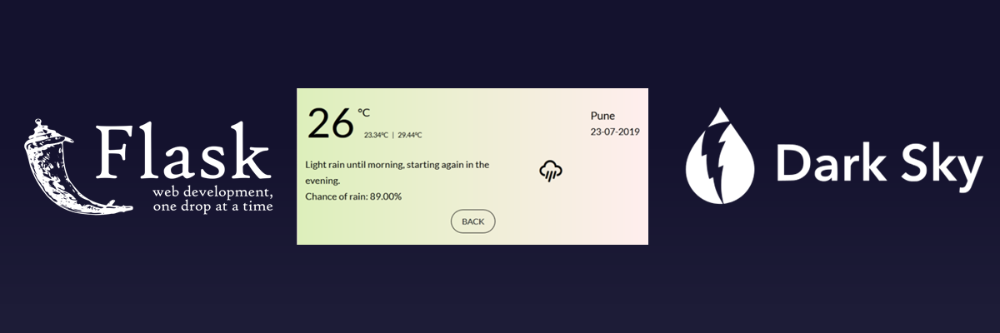
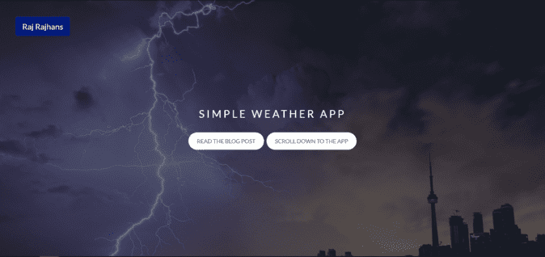
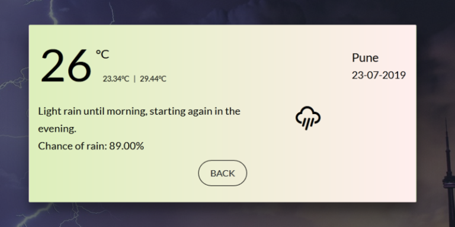
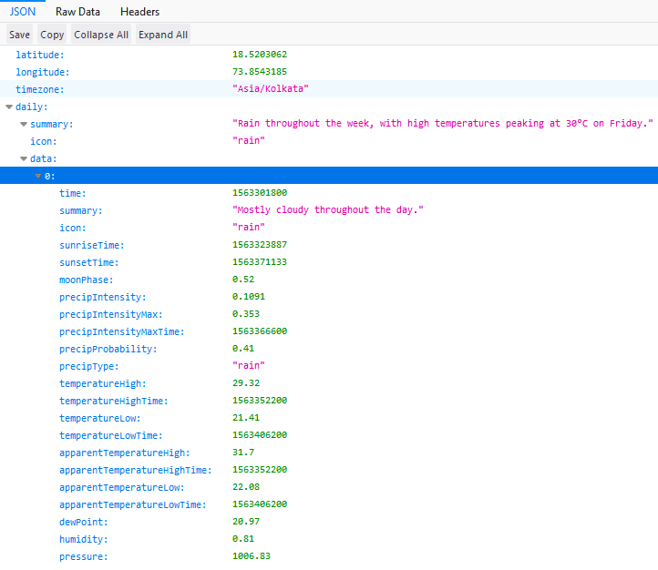
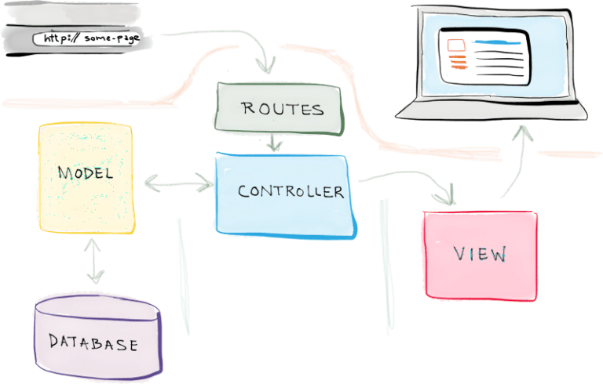

<AlertInfo><ExtLink link="http://weather.rajrajhans.com/">This project is deployed and is live! Check it out</ExtLink></AlertInfo>



<Alert><ExtLink link="https://github.com/rajrajhans/weather">GitHub repository for this project</ExtLink></Alert>

Howdy there, fellas! So <ExtLink link={"/2019/07/apis-explained-weather-app-openweathermap/"}>last time we made a simple command line based application</ExtLink> which would show us the weather for our desired city using the OpenWeatherMap API. But, well it was just a command line application. Today we will make a web based interface to interact with the application we created. This is a rather long post, as it covers a complete MVC WebApp Development project with beginner-friendly explanations included where ever possible.

I have also included screenshots of what we would be building below.





# Changing the API

This time, we shall use the DarkSky API for weather data since they have slightly better structure and also more accurate data. I have found that sometimes, OpenWeatherMap’s weather data is not accurate for my city, and DarkSky has received pretty good reviews from the dev community. We will be using their free tier. They have a limit of 1000 calls per day which is sufficient for us. You will have to register a account, after which you will receive a secret key which will be needed to access the API. The endpoint for the Dark Sky API is –

`https://api.darksky.net/forecast/YOUR_SECRET_KEY/[latitude],[longitude],[time]?units=si`

In the OpenWeatherMap API, we used to pass the name of the city directly. But here, we will have to first convert the City Name to lat long (latitude, longitude) co-ordinates before passing it to the API. More on that later. One more good thing about the DarkSky API is that it allows us to fetch the weather data of a particular date and time by adding a [time] parameter to the request. This will allow us to implement an additional feature in the app.

We only need the daily data for our purpose, but by default the API provides hourly, weekly data as well, which we won’t use. For this, DarkSky provides an exclude parameter where we can specify what data we don’t want. Here is the data returned after excluding everything other than daily data.



# Model, View, Controller (MVC) Pattern

We will follow the <ExtLink link={"https://en.wikipedia.org/wiki/Model%E2%80%93view%E2%80%93controller"}> MVC Design Pattern for Software Development </ExtLink> in this WebApp. MVC stands for Model, View, Controller. The Model structures your data in the required form based on controller’s instructions. The View displays the data to the user according to user’s actions, in a easy to understand interface, and the Controller accepts user inputs and sends commands to the model for data updates and also to the view for updating the interface. Have a look at the image below to understand this more clearly.



# Getting Started : The Model

As we discussed, the model part is related to structuring and defining the data. So, setting up the database model would be included in this file. Now, in our case, we don’t need a database. We will only create a model for the data that we need, this will involve creating a class called WeatherReport, which would include all the attributes we would need for the report.

We will need the following for the report – date, maximum temperature, minimum temperature, summary, raining probability, and the icon for the day.

```python
class WeatherReport():
    def __init__(self, date, max_temp, min_temp, summary, raining_chance, icon):
        self.date = date
        self.max_temp = max_temp
        self.summary = summary
        self.raining_prob = raining_chance
        self.icon = icon
```

So the code for the model is pretty self explanatory if you understand Object Oriented Programming in Python. The __init__ method is a constructor that initializes the attributes of our class. At this point, that is all we need in our models file. Let’s move on to controller.py

# The Controller

This will be the file where we would do most of our heavy lifting. Before moving on to writing the code, let’s discuss what all we want to do in this file.

1. Convert the City Name to geocode. For this we would use the Nominatim geocoder from the GeoPy library.
2. Request required weather data from the API – using the requests library.
3. Parse the response from the API and extract necessary values from it (temperature – max, min, summary, raining chance, icon)
4. Store the corresponding data in a WeatherData class’s instance object.
5. Return the object containing requested weather data.

So, considering these goals, here is the code.

```python
from model import WeatherData
import requests
from geopy.geocoders import Nominatim
import time

DARKSKY_SECRET_KEY = 'YOUR_DARKSKY_API_KEY'  # Your DarkSky API key here
option_list = "exclude=currently,minutely,hourly,alerts&amp;units=si"  # Asking the API to not send above data fields as we only need the "daily" datapoints

class Controller:
    def getGeocode(self, name):
        """Converts Location Name to Geocode using Nominatim()"""
        geocode = Nominatim(timeout=5).geocode(name, language='en_US')
        return geocode

    def getWeatherData(self, date, location):
        """This function does 4 things:
            1. Hit the API with a customized request and then store it in response.json
            2. Parse the response.json and extract necessary values from it (temperature - max, min, summary, raining_prob, icon)
            3. Store this parsed info in a object of class model.WeatherData
            4. Return WeatherData object
        """
        lat = str(location.latitude)
        long = str(location.longitude)

        response_raw = requests.get(
            "https://api.darksky.net/forecast/" + DARKSKY_SECRET_KEY + "/" + lat + "," + long + "," + "?" + option_list)

        # """Provision for including date""" response = requests.get("https://api.darksky.net/forecast/" + DARKSKY_SECRET_KEY + "/" + lat + "," + long + "," + date + "?" + option_list)

        response = response_raw.json()
        current_date_epoch = response["daily"]["data"]["0"]["time"]
        current_date = time.strftime('%d-%m-%Y', time.localtime(current_date_epoch))
        max_temp = response["daily"]["data"]["0"]["apparentTemperatureMax"]
        min_temp = response["daily"]["data"]["0"]["apparentTemperatureMin"]
        summary = response["daily"]["data"]["0"]["summary"]
        raining_prob = "Chance of rain: %.2f%%" % (response["daily"]["data"]["0"]["precipProbability"])
        icon = response["daily"]["data"]["0"]["icon"]

        report = WeatherData(current_date, max_temp, min_temp, summary, raining_prob, icon)
        return report
```

# The Views

For us, a WebApp, our views would be HTML files, which would display the data. Here, we will have to design the user interface and implement it in HTML. I will now discuss the designing and html-css part of creating the views, as it is not in the scope of this article. But, let’s discuss the important part, that is, connecting the view and the controller (and thus, model). The most important part in index.html is the form element, which actually does all the work. The rest is purely for decorative purposes.

```html
<form method="post" action="{{ url_for('weather') }}">

        <label for="city">Enter the city name: </label>
        <input type="text" id="city" name="city" placeholder="Enter the name of the city" required>

        <input type="submit" value="Submit">
</form>
```

So, this is the form element that does all the work of sending the data from the front end to the controller part of backend. What I want you to focus on is – First, the action attribute of the form element. We have set it to the url for the weather() function, which is /weather. And, the method attribute is set to POST. So, when the user fills the form and hits the submit button, the form will hit the /weather URL with a POST request containing the user inputted data. This way, we hand over the data to Flask app.py. There, we have to first extract appropriate data from the request object and send it to controller.py. But how does the backend know what input is what? Answer – the “name” and “id” attributes of the input element. So, here we sent the data from the front end to the backend. Next, we’ll do processing on that data and send it to controller.py. Refer to the next section for the same.

# app.py

app.py is the file which has the configuration for our Flask app and also starts the app.In the MVC terminology, app.py falls under “Controllers”. We define the routes for our application in this file. It is pretty standard in all Flask projects. This is the code for app.py –

```python
from flask import Flask, request, render_template
from controller import Controller

app = Flask(__name__)

@app.route('/')
def index():
    return render_template("index.html")

@app.route('/weather', methods=["GET", "POST"])
def weather():
    weatherObj = None
    errors_geo = None
    if request.method == "POST": #Handling the form request
        city = request.form["city"]
        wr = Controller()
        try: #Error will come if city name is wrong or there is a problem with DarkSky servers.
            location = wr.getGeocode(city)
            weatherObj = wr.getWeatherData(location, city)
        except:
            errors_geo = "Something went wrong. Please check your city name and try again later. "
    return render_template("weather.html", weather=weatherObj, errors_geo=errors_geo) #sending the weatherObj object which contains all the required data to render.

if __name__ == '__main__':
    app.debug=True
    app.run()
```

As you can see, we have done the routing part in this file. We have also passed required data to the views in this file for them to render. Plus, we have done some basic error handling in this files and passed the require errors to the views. Lastly, we have started the app using the app.run() call which starts all the required components for the app to run.

# Conclusion

This was a 3 week long project built during my summer vacation as a freshman. Project goals included using technologies learned up until this point and familiarizing myself with the MVC design pattern for developing software and using APIs in Python.

Initially, this project started as a command line based program that took input from the user and showed the weather on command line itself. It then evolved as a WebApp built using Flask and following the MVC pattern.

One of the main challenges I faced was the timeout error that was raised because of the usage limits of Nominatim, which is a free geocoding API by OpenStreetMaps. I solved this problem by writing a recursive function that called itself after a sleep period of 1 second if there was a timeout error due to Nominatim.

I also faced some inconvenience organizing the code files during developing the front-end of the application as I used plain HTML and CSS. I intend to improve this by using ReactJS for the front-end to make the development process more seamless and easy to change and reuse.

That’s it for today. Hope you liked the article. See you in the next post!

