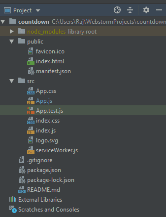
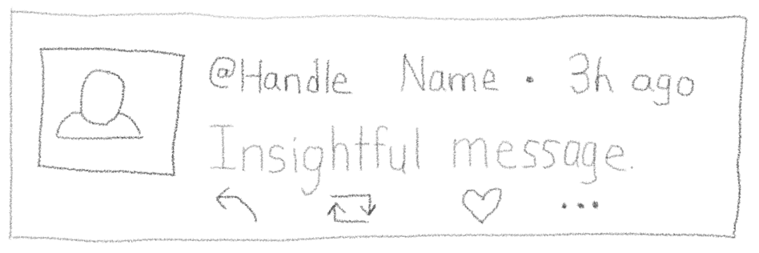
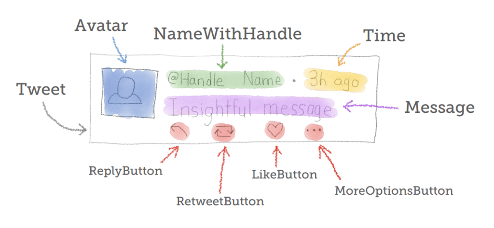
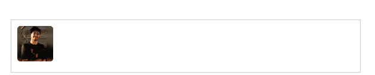
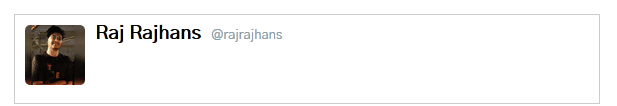
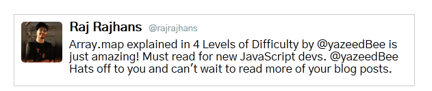
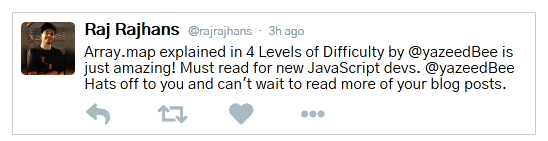

<Alert><ExtLink link="https://github.com/rajrajhans/tweet-component">GitHub repository for this post</ExtLink></Alert>

Hey there! Over the past few years, you may have come across ReactJS more and more frequently. React is one of the hottest front-end technologies out there today, and for good reasons. In this post, we shall first see why React is useful, what is React, and why you should learn it today. As a bonus, I will also show you, step-by-step, how to create a simple component that displays a tweet. Let’s get started!

We developed the Weather app using Flask for back end and we used HTML, CSS for building the front end. That works, but building a complex user interface with HTML CSS gets messy really quickly. This is where React comes in.

ReactJS is a library for building user interfaces. It makes building complex interfaces really easy. In React, the interface is made up of independent parts called as components. It makes your code modular. You can even reuse components anywhere you need. Plus, interfaces built with React are very fast. It uses something called as virtual DOM, which is the reason behind it’s fast performance. Also, React Native, which is a framework for building Android and iOS applications, uses React. So, you can also develop Android and iOS apps using React Native if you know React well. So, all these reasons make React a very rewarding technology to learn. If you want to learn React, I will highly recommend freeCodeCamp’s Front-End Certifications course. In this post, we shall build some basic components using React.

I use WebStorm and create-react-app for easy project configuration setup for creating a React app. Following is the project structure after creating a create-react-app. To know more about the create-react-app structure, go here.



npm is a package manager for JavaScript. You can run your app in development mode by running npm start. To create a production build, you have to run npm run build. Enough about the tools, let’s dive in to the code!

# The Tweet Component

Here let’s build a component that will display a tweet. Now, for building a component, I like to follow Dave Ceddia’s 4-step process:-

1. Make a sketch of end result
2. Carve the sketch into compenents
3. Give them names
4. Write code for each

So, let’s start building the tweet component. First, we’ll draw a simple pen-and-paper sketch of what we are aiming to build



Then, we will move on to dividing up the sketch (main component) into various components. Here’s what that would look like –



Let’s get to building the components. Note that here, I have only included the JS code for actual component and haven’t included any CSS styling, as the focus of this post is on building component. If you want to check out the rest of the code, check out the GitHub repository for this project, which contains the complete code. For the icons, we’ll be using font-awesome. We’ll be doing this by a top-down approach. So, the parent component, i.e. the Tweet component gets built first. Here’s the code for it –

```js
class Tweet extends React.Component{
    constructor(props){
        super(props)
    }

    render(){
        return(
            <div className="tweet">
                <Avatar />
                <div className={"content"}>
                    <NameWithHandle />
                    <Time/>
                    <Message />
                    <div className={"buttons"}>
                        <ReplyButton />
                        <RetweetButton/>
                        <LikeButton/>
                        <MoreOptionsButton/>
                    </div>
                </div>
            </div>
        )
    }
}
```

Now, let’s create the child components, starting with the Avatar component. The avatar component would be pretty straightforward – just rendering the user’s profile photo.

```js
class Avatar extends React.Component{
    render(){
        return(
                
        )
    }
}
```



Next, we’ll create the NameWithHandle and Message components –

```js
class NameWithHandle extends React.Component{
    render(){
        return(
            <span className={"name-with-handle"}>
                <span className={"name"}> Raj Rajhans </span>
                <span className={"handle"}> @rajrajhans </span>
            </span>
        );
    }
}

class Message extends React.Component{
    render(){
        return(
            <div className={"message"}>
                Array.map explained in 4 Levels of Difficulty by @yazeedBee is just amazing! Must read for new JavaScript devs. @yazeedBee Hats off to you and can't wait to read more of your blog posts.
            </div>
        )
    }
}
```


<div style="text-align:center">Image - After adding the NameWithHandle component and styling</div>



<div style="text-align:center">Image - After adding the Message component and styling</div>

Time to code the Time, ReplyButton, RetweetButton, LikeButton, MoreOptionsButton components. These are fairly short and simple.

```js
const LikeButton = () => (
    <i className={"fa fa-heart like-button"} />
);

const RetweetButton = () => (
    <i className={"fa fa-retweet retweet-button"} />
);

const MoreOptionsButton = () => (
    <i className={"fa fa-ellipsis-h more-options-buton"} />
);

const ReplyButton = () => (
    <i className={"fa fa-reply reply-button"} />
);

const Time = () => (
    <i className={"time"} />
);
```

As you can see, we have created these components by using Arrow functions as they are short and don’t involve complexities.



That looks like we have done what we set out to do! But, in this example, we have explicitly put in data to render. There is nothing “reusable” about this component. However, it can easily be made reusable by using what is called as “props” in React. Props is nothing but data in React – terms. So, instead of writing the “message” explicitly, we pass a object “tweet” to the parent component and then the parent component passes “tweet.message” to the message component, “tweet.name” to the HandleWithName component and so on. This is the one way flow of data from parent to child in React.

You can make the reusable version as a challenge by passing props, as it would be good practice. If you want a reference, check out the github repo, where I have made the reusable one.

We learned creating a basic component with parent child concept in React. We also learned why props are useful to make the component reusable in this post. Let’s explore more of ReactJS in the next posts.