<Alert><ExtLink link="https://github.com/rajrajhans/shopping-cart-react">GitHub repository for this post</ExtLink></Alert>

Hello there, this post is a short discussion on a small project which involved attempting to create a basic Shopping Cart using ReactJS. The source code can be found on GitHub on the link given above. You can instantly deploy the WebApp on Netlify by connecting your repo.

For building this, a basic understanding of JavaScript, what React is and how it works is required. I’d recommend you to read up on them first before moving ahead. Here is a link to a previous post which will help you in understanding the philosophy and the syntax of ReactJS.

Before starting out, let’s first see what we are going to build first. We are building a basic Shopping Cart with some really basic features to get started. After we understand the flow of data in React, we can build upon this and add more features to our cart. Below are some screenshots to give you an idea of what we are building.

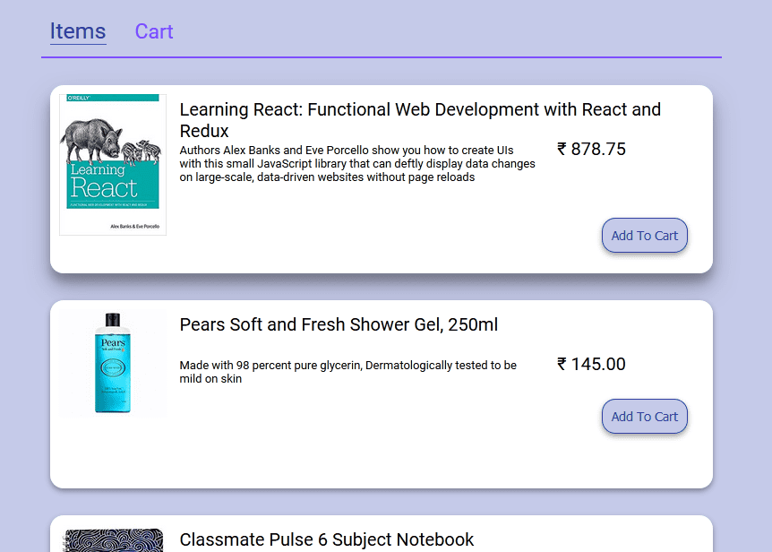

<div style="text-align:center">Image - Interface we are building</div>

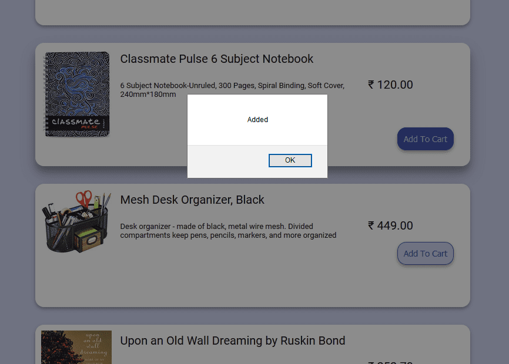

<div style="text-align:center">Image - Alert shown after user clicks 'Add to Cart'</div>

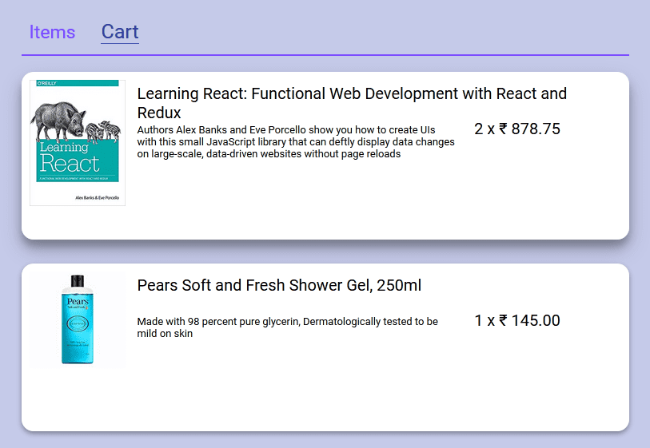

<div style="text-align:center">Image - Cart showing number of items added with price</div>

# Designing the Components to be made

Before starting to actually do anything, it is always advisable to make a basic wireframe of the application – first using pen and paper and then using something like PowerPoint (go PowerPoint!) to get an idea of the structure that you want to build. Here are the wireframes of the structure we want to build. These are just structures, we will do color selection later.

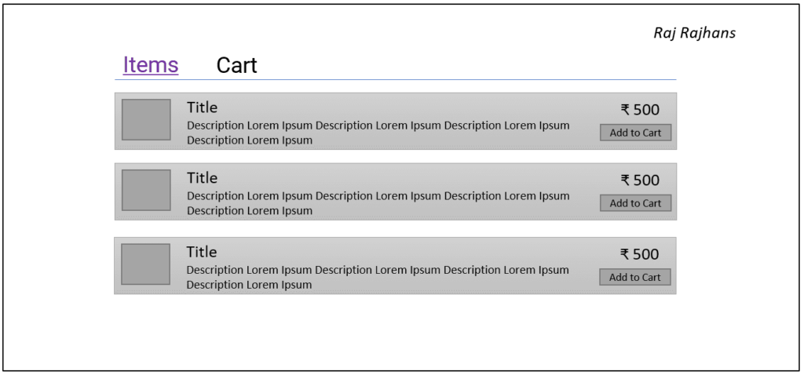

<div style="text-align:center">Image - Wireframe of the 'Items' tab</div>

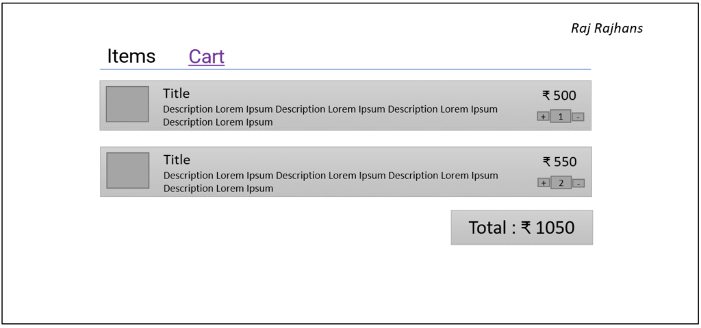

<div style="text-align:center">Image - Wireframe of the 'Cart' tab</div>

First, the application has to be divided into subcomponents. There would be a “Nav” component that would simply render the navigation bar. This is a “dumb” (presentational) component. It just renders the navigation bar.

Next, the navigation bar would have two tabs. namely Items and Cart. The Items page would list the items that are available, along with Item’s name, description, price, and an option to add to card. There would be many items so we would have to use array.map() to render the list of items. This component was named “ItemPage”. The cart page will list items added to cart by the user, along with their name, description, price, and number of items added to the cart. It will also contain a list of items so we will use array.map() here as well. Finally, the total amount to be paid would be shown to the user below the cart.

Deciding what colors to use can be a time consuming decision in any project, so I used materialpalette.com to select a color palette that looked good. These are the colors used in the project.

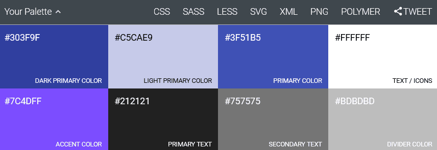

So after finalizing the structure and colors for the interface, let’s code the components.

# Creating the Components / Development

Below are some of the notable challenges faced during developing the cart.

## 1. Keeping track of active tab

We will need to keep track of which tab is open, ItemPage or CartPage and render that tab accordingly. To do this, we shall store the tab in the state of the App component and then make the Nav trigger a state change. So, the App component was initialized with the state activeTab set to 0.

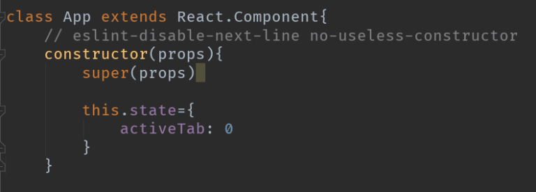

<div style="text-align:center">Image - App component</div>

We will also need to handle the tab change. For that, we create a function (method) in App component which shall change the activeTab to whatever tab we want to change. For this, we will need to make use of this.setState.

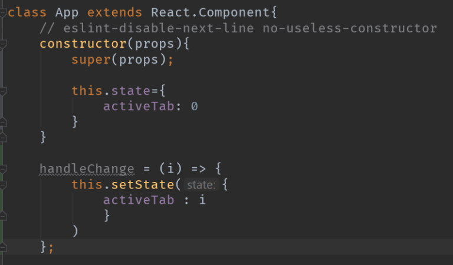

<div style="text-align:center">Image - App component with handleChange function</div>

Now, we will pass this.state.activeTab and this.handleChange to the Nav component. Where, handleChange will be used with onClick to change the state and thus, render the correct content corresponding to the active tab. In this way, we have implemented a simple Navigation Bar system in React.

## 2. Displaying a list of items

It can be said that all web apps boil down to displaying a list of n number of items in some or the other way. In our case, we have an array of objects named ‘cart’ (which is actually ‘testItems’ in data.js), in which each of the object has the details of the respective product, i.e. name, price, description, etc.

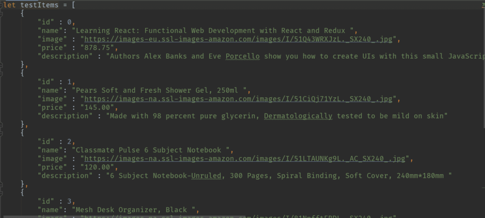

<div style="text-align:center">Image - data.js containing sample data</div>

We need to iterate over each of these objects and display each of it’s property in a pretty way. So how do we do that?

This code for this is in the ItemPage.js or CartPage.js file. We have passed the array to ItemPage as a prop. We will use the array.map() method to achieve our intended result.

The Array Map method operates on an array to run a transformation on every element of the array. For the “transformation”, we supply a callback function which is called for each element in the array. After executing the code in the callback function for each element of the array, the map() method returns the new transformed array, thus leaving the original array unchanged. As you can see, this method can be used in many circumstances. Let’s take a simple example illustrating the array.map() function before we see how we’ve used that to display list of items.

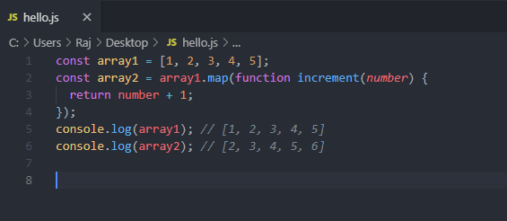

<div style="text-align:center">Image - Illustrating Array Map method</div>

Here, we’ve used the callback function ‘increment()’ to return the incremented argument. On line 5, and 6, we log the original array, and the array returned by the map function. We can see that the original array remains unchanged.

Coming back to our purpose, this is how we have used array.map() –

```js
class ItemPage extends React.Component {
    // eslint-disable-next-line no-useless-constructor
    constructor(props) {
        super(props)
    }

    render() {
        return ( <
            div > {
                this.props.items.map(item = & gt;
                    (
                        this.props.onAddToCart(item)
                    }
                    /&gt;
                ))
        } < /div>
        )
    }

    shouldComponentUpdate(nextProps, nextState, nextContext) {
        return false;
    }
}
```

where Item is just a “dumb” presentational component which takes in the object ‘item’ and displays it nicely.

```js
class Item extends React.Component{
    // eslint-disable-next-line no-useless-constructor
    constructor(props){
        super(props)
    }

    render(){
        return(
            <div className={"ItemContainer"}>
                <div className={"ItemImage"}>
                    
                </div>

                <span className={"ItemName"}>
                    {this.props.item.name}
                </span>

                <span className={"ItemPrice"}>
                    ₹ {this.props.item.price}
                </span>

                <span className={"ItemDes"}>
                    {this.props.item.description}
                </span>

                <button className={"addToCart"} onClick={this.props.onAddToCart}>
                    Add To Cart
                </button>

            </div>
        )
    }

    shouldComponentUpdate(nextProps, nextState, nextContext) {
        return false;
    }
}
```

One important thing to note here is while using the Array Map method in React’s context, it is important to pass a ‘key’ prop to the callback function. React uses this ‘key’ while rendering to keep track of each individual item.

## 2. Keeping track of items added to cart

When the user clicks on the ‘Add To Cart’ button, the product should be added to the ‘cart’ array and the user should be informed of the same via an ‘alert’. To handle this, we define a function called onAddToCart() in App.js.

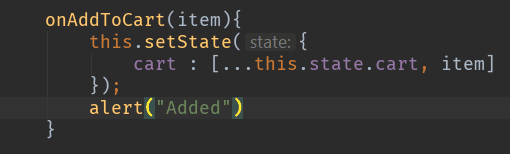

<div style="text-align:center">Image - onAddToCart method</div>

This function does a simple task. It adds (appends) the given item to the cart using the spread (…) operator and displays an alert saying ‘Added’. Now, we have to figure out when to and how to trigger this function. We pass this function as a prop to CartPage.js and specify the onClick attribute to “this.props.onAddtoCart”.

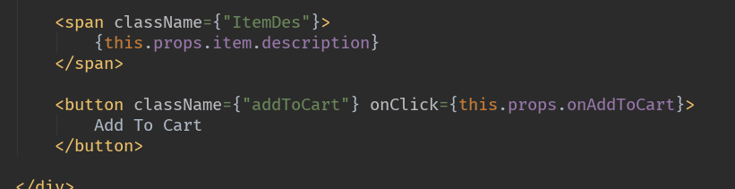

The onClick attribute is used to handle click events. Now, when the Add To Cart button is clicked, it will call the onAddToCart function.

These are some of the interesting challenges that I faced while developing a basic shopping cart. We can add many more features upon this, like adding the ability to add multiple items at the same time, removing an item from the cart, and showing the total amount of purchase the user has done, etc. With this we continue our journey exploring the various facets and uses of ReactJS. See you in the next post!
