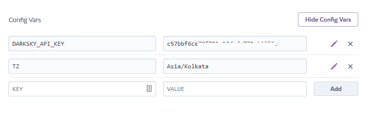

Last week, we developed a Flask based Weather app and deployed it on Heroku Cloud. Missed the posts? Here are the links if you want to check them out.

This is a short follow-up post to the weather app post.
So, after the WebApp going live, I received a issue on GitHub saying that the date it was showing was incorrect. That is, if it was 29th morning, it would show you the date as 28th. I fired up the app on my local machine. It was working fine!

From this, I concluded that it must be an issue of timezones. That I must have used system time in my program. But here's the thing, I was pretty sure that I didn't use system time directly, I used the time from the API response. Then how was it showing different times on local and remote? The confusion grew wider.

After digging into the code, I realized that I was using Python's time.localtime module to convert the date from epoch to user friendly format, and guess what? The time.localtime module uses system's timezone, so it was using Heroku dyno's timezone, which was set to USA. After changing the timezone appropriately, it worked fine. Here, I'll explain how you can change your timezone on Heroku dyno.

Heroku by default has UTC as it's time zone. Luckily, you can change the timezone for your app by simply adding a new config var called 'TZ'. There are two methods to do this - from the Heroku CLI and from the Heroku Dashboard

# From the Heroku CLI

For this, you should have Heroku CLI installed on your local machine.
1. Open your terminal
2. Log in to heroku using heroku login
3. Navigate to your app's dir.
4. Setup your new config var using the following command -

```bash
heroku config:add TZ="Asia/Kolkata"
```

# From the Heroku Dashboard

1. Log in to Heroku dashboard through your browser
2. Go to the app's settings
3. There, you'll see a 'Reveal Config Vars' option
4. Set the key to 'TZ' and the value to 'Asia/Kolkata' (the timezone you wish to change to)
5. Press the Add button



To check the current TZ value, you can simply type

```bash
heroku config:get TZ
```

So that's it for this short post. Hope this helps you in case you have a similar problem.