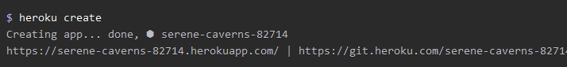
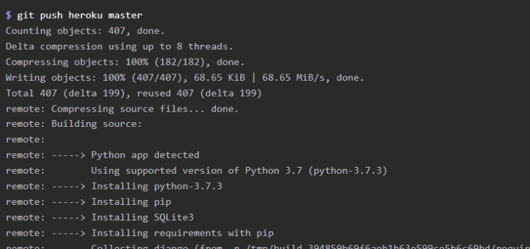
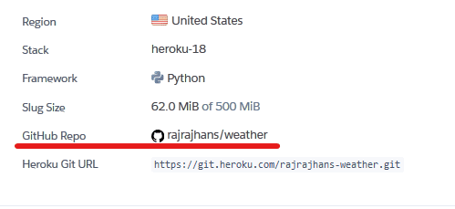
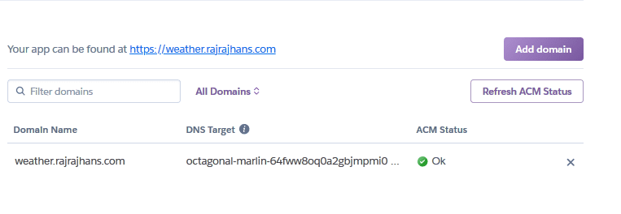
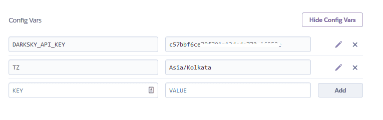
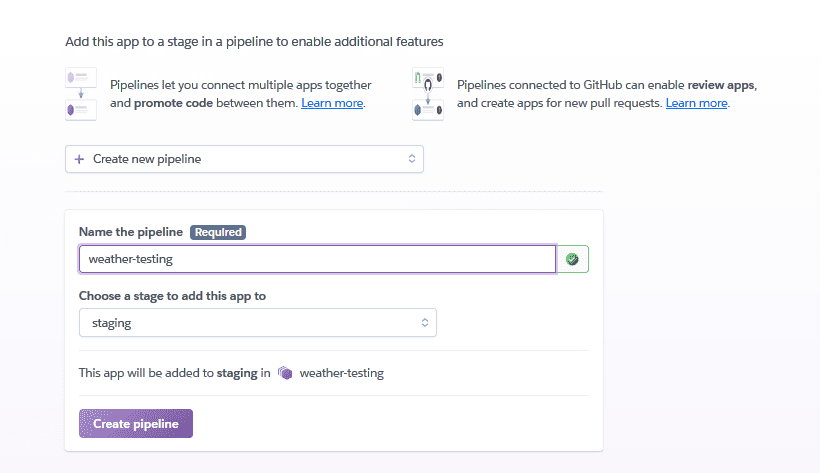

Hola fellas! In a previous post, we had created a Flask webapp that would show the weather of a particular city. <ExtLink link={"/2019/08/case-study-developing-weather-webapp/"}>Here’s the link</ExtLink> if you haven’t read it.

You can see the webapp in action at weather.rajrajhans.com, as it is hosted on Heroku. Today, we shall discuss about deploying a Flask based WebApp to Heroku.

# What is Heroku

In simple words, Heroku is a managed application hosting service. With Heroku, you just push your code using Git, for instance and it automatically handles deploying and serving it. All the infrastructure related workload is handled by Heroku itself. That’s why the “managed” part in “managed application hosting service”. Due to this reason, Heroku is also called as a Paas (Platform as a service).

This is unlike when you buy a VPS (Virtual Private Server). When you buy a VPS, you have to be responsible for all the infrastructure related work like restarting the server in case of a hitch, routing HTTP requests, OS updates, system architecture etc. Heroku handles all that for you and allows you to focus on the app and it’s code. So, for a web dev beginner with limited knowledge of DevOps, who wants to host his app on the cloud for the world to see, Heroku is the best option.

# Is Heroku Free

Heroku has a free tier which has some limitations. However, if you are a student, you can get the Hobby Dyno ($7/month) for free. Check out the details regarding that here [<ExtLink link="https://www.heroku.com/students">https://www.heroku.com/students</ExtLink>].

# Prerequisites

1. Your app is running fine locally without any errors.
2. You have a basic knowledge of git.

# Deploying the app to Heroku

Start off by downloading the Heroku CLI (Command Line Interface). Through the Heroku CLI, we will deploy and manage our app. After installation, go to the terminal and run the following command.

```bash
heroku login
```

You will be asked to enter your credentials after which you will be logged in.

We will be using the gunicorn WSGI server as it is more suitable for handling production level requirements than Flask’s built-in web server. Flask’s built in server is suitable for developmental purposes. In case you’re wondering what is WSGI, or Gunicorn, I’ve covered that in a separate blog post – How does my WebApp work?

First, install gunicorn in your project using

```bash
pip install gunicorn
```

Then, freeze your app’s dependencies to a text file named requirements.txt using

```bash
pip freeze &gt; requirements.txt
```

Create a file named “Procfile” in your project root. It should contain the following code –

```bash
web:gunicorn app:app
```

What this line does is that it specifies that you are using the gunicorn web server. The ‘app:app’ specifies the module and application name. In our Flask application, our module as well as the Flask application is called ‘app’.

Next, you can create a Heroku app if you haven’t already using –

```bash
heroku create someuniquename
```



After this, push your changes to Heroku’s master branch.

```bash
git add .
git commit -m "Deploy"
git push heroku master
```



The application is now deployed. To ensure at least one instance of the app is running –

```bash
heroku ps:scale web=1
```

With this, we have successfully deployed our Flask app to Heroku and can now be accessed by anyone on the internet. We can do many things after this in Heroku to add more features. Let’s take a brief look.

# Configuring PostgreSQL Database for your app
First, make sure you are using PostgreSQL in your flask app. This is my database setup wherein I am using SQLite on my local machine and PostgreSQL on Heroku:

```python
if 'HEROKU' in os.environ:
    import urllib.parse, psycopg2

    urllib.parse.uses_netloc.append('postgres')
    url = urllib.parse.urlparse(os.environ["DATABASE_URL"])
    DATABASE = PostgresqlDatabase(database=url.path[1:], user=url.username, password=url.password, host=url.hostname,
                                  port=url.port)
    DATABASE_proxy.initialize(DATABASE)
else:
    DATABASE = SqliteDatabase('social1.db')
    DATABASE_proxy.initialize(DATABASE)
```

Follow these steps to configure the database for your application.

1. Make sure you have installed psycopg2 and gunicorn and requirements.txt is updated
2. Provision Database using `heroku addons:create heroku-postgresql:hobby-dev`
3. SET "HEROKU" to 1 in Heroku's env vars
4. Run app.py from heroku bash as it has the code that initializes the database
5. Use `heroku pg:psql` to run queries on live database

# Connecting a GitHub repo

Instead of manually pushing our code to Heroku’s servers each time we make a change, we can connect out Heroku app to our GitHub repo so that whenever there is a change pushed to the repo, Heroku will pick it up and re deploy the app. You a connect a GitHub repo from the Settings of your Heroku app from the dashboard.



# Custom Domain

By default, your app can be accessed by a .herokuapp.com URL, you can also connect your custom domain to your Heroku app. For that, you will have to add some A records that Heroku will give you in your Domain Registrar’s settings. After successful DNS propagation (which might take upto 24 hours), you can see that your app is linked with a custom domain



# Adding config vars



# Creating a CI / CD pipeline

You can create a pipeline in Heroku to simplify testing. Heroku has a great feature called Review Apps wherein whenever you open a pull request on the repo, Heroku automatically deploys a test app for that pull request so you can easily see the changes.



# Debugging using Real Time Logs

You can see your app’s logs by the following command

```bash
heroku logs
```

You can also see the logs in real time using the following command

```bash
heroku logs --tail
```

This feature really helps to triangulate what exactly is causing a problem in your app.

So that’s it for today’s post. Hope this helped you get some clarity on what Heroku is, and how you can deploy your Flask WebApp on Heroku.
