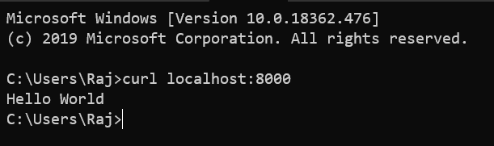
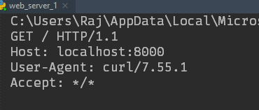
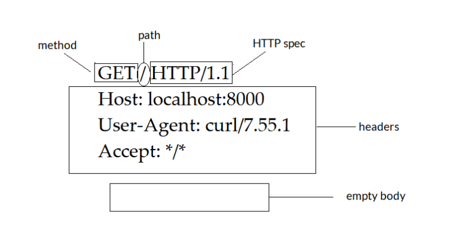
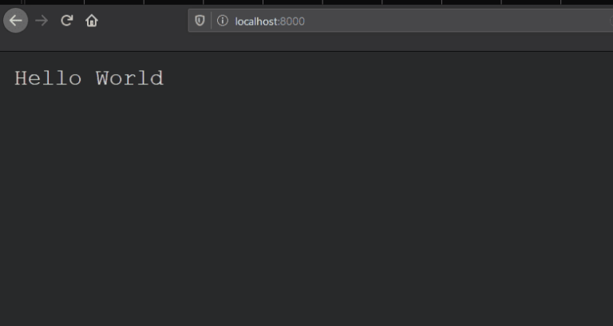

In the last post, we saw what a web server is, what WSGI is. In this post, we will go a step further and build one. Why? Well, because we can. And also because it will help us get a clearer idea of how a web server works and how requests are handled.

# What does a web server do?

So, before going ahead with building a web server, let us first clear the basics. What do we need to do for ‘building a web server’? We need to accept HTTP through sockets, we need to parse the HTTP, and then send back HTTP response to the request.

## Version 0 : Sending ‘Hello World’ as response on a request.

This is as simple as the implementation of a ‘web server’ can get. Here’s the code –

```python
import socket

with socket.socket() as s:
    s.bind(('localhost', 8000))
    while True:
        s.listen(1)
        conn, addr = s.accept()
        with conn:
            request = conn.recv(1024).decode('utf-8')
            print(request)
            conn.sendall('Hello World'.encode('utf-8'))
```

Let’s go through the code. First, we are ‘binding’ our socket to the localhost at port 8000. Then, in an infinite loop, we are listening to that socket. After that, in case a request comes, we accept that request and store the requisite client IP and addr value, which is basically the socket. Then, we decode the incoming (accepted) request, print it on the terminal, and send back ‘Hello World’. A thing to note here is the .encode() and .decode() function. Data transferred over the network is in bytes, so the sendall() function expects the argument in bytes, so we are encoding our ‘Hello World’ message in UTF-8 using the .encode() function.

Now let’s see how this works.
First, let’s use CURL (cURL is a command line tool intended for file transfer that supports various protocols including http/https, we are using curl to send requests to server/client) to hit ‘localhost:8000’.



As you can see, we have received ‘Hello World’ as the reply from the server. Now if you look at the code, we have also printed the request coming in, so the terminal must have a record of the request that it just accepted. Let’s check that.



This is the request that curl sent to our localhost to which, the localhost replied ‘Hello World’. So we’ve just seen the basic function of a web server, that is, to reply to requests with a certain response.

This is a good time to dissect the HTTP request. The ‘GET’ part specifies the method, followed by ‘/’, which is the path, that is the URL that was asked for. Then, the ‘HTTP/1.1’ is the specification of the protocol that the request follows. The three lines after that are the headers of the request. Then, because we are just making a simple request, the body is empty.



Now, before moving further, let’s check what happens if we hit localhost with a browser instead of curl. First, let’s try with Firefox. This is what we get in the browser and in the terminal.




The second image shows the requests that Firefox sends to a URL that you enter in the browser, now, our web server being very simple, ignores everything else and just sends a ‘Hello World’ back. An interesting thing to note here is the browser sends to requests, one your basic GET request for the URL, and the other, a request for the favicon of the website. Now, if you visit the same with Chrome, it’ll show you an error saying the HTTP returned was invalid. This happens as we are just sending back ‘Hello World’, we need to respond with valid HTTP so that all browsers would understand the response.

## Version 1 : Parsing the HTTP Request.

We have seen the pattern followed by a HTTP request above, now, let’s write a code to parse that request.

```python
def parsehttp(http):
    request, *headers, _, body = http.split('\r\n')
    method, path, protocol = request.split(' ')
    headers = dict(line.split(':', maxsplit=1) for line in headers)
    return method, path, protocol, headers, body
```

This is a simple function that takes in the http request as a string and splits that request into it’s individual components that we have seen above, and returns a tuple of the method, path, protocol, headers, and the body of the request.

Now, we need to respond with HTTP instead of just ‘Hello World’. This is what a HTTP response looks like –

```python
HTTP/1.1 200 OK
Content-Type: text/html
Content-Length: 11

Hello World
```

The pattern is similar, you have your protocol, the status code, some headers, and a body as well.

From here, you can change the ‘Hello World’ response to anything, an object, HTML document, etc. This illustrates the most basic version of a web server. As an example, I’ll include a web server returning more than just ‘Hello World’ in the github repo linked above, check it out if you want to take a look. That’s it for today, see you in the next post!
