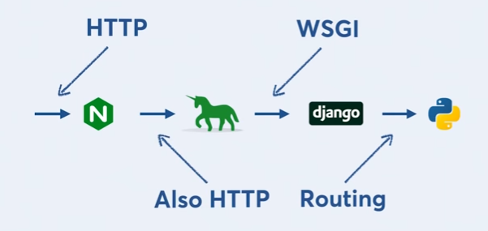

In a previous blog post, we made a weather webapp using Flask. We also deployed it on the internet using Heroku. Now an interesting question that occurs is, how is it actually working? I mean, yes, you have coded the app in Python and your views in HTML, but how is it "served"? In this post, we will try to uncover web servers in the context of a Flask application.

If you remember, we had installed something called 'gunicorn' while deploying our app to Heroku. Gunicorn is a Web Server Gateway Interface HTTP Server. What does that mean? Let's dive in.

In the early days, the term 'web server' meant static web servers. All it did is serve static HTML files to incoming requests. This meant that things like sessions, dynamic views weren't possible then. When you had to change something, you would have to go and edit the HTML file. Then came an idea called 'Common Gateway Interface'. This was the idea that instead of serving a file, you would invoke a script. This approach is mostly used in Perl / PHP environment.

However, when Python applications were on the rise, there was a need for something that would facilitate communication between the web server (apache / nginx) and a web application (flask / django). The idea is for a separate web server and a separate Python application that we can pass requests into when we get them, and we can get the response back out to send to the user. That is the purpose that WSGI was seeking to fulfill.

The Web Server Gateway Interface (WSGI) was meant to be a standard interface between web servers and Python web applications and frameworks, to promote portability across web server. This meant you weren't tied to a particular web server like Apache or nginx. You can switch to any other thing that could talk to this common interface, that is, WSGI. This common interface provided a huge advantage and abstraction. Now, app developers, like you and me, don't need to know everything about HTTP, about how to serve requests, you could just build something that implemented a WSGI server. Gunicorn is one such popular WSGI server.

So, what we can infer from this is that the application framework (Flask / Django) doesn't interact with nginx / apache directly at all, it just interacts with the WSGI. To further solidify our understanding, let's take a look at what happens when a visitor uses a browser to visit our webapp.

1. The visitor types in weather.rajrajhans.com into browser and hits enter.
2. The browser talks to nginx using the hypertext transfer protocol (HTTP), requesting a file. The request would look like this: GET /path/to/file HTTP/1.1
3. Nginx then asks Gunicorn using HTTP to serve up the file, using the exact same request, GET /path/to/file HTTP/1.1
4. Gunicorn executes python code which produces a HTML file, and returns it to nginx in answer to the HTTP request nginx sent in step 3.
5. Nginx gets the response from Gunicorn, and returns it to the browser in answer to the HTTP request the browser sent in step 2.
6. The browser parses the HTML, there are various static files such as images and javascript.
7. For every static file, the browser creates a new HTTP request asking nginx for that file
8. Nginx gets the request, and responds with the file.

The reason it's done like this is because nginx is very good at serving static files, and your static files don't need to be dynamically generated by Python, because they never change. So nginx serves your static files straight away, and passes on requests that need to be dynamically generated to Gunicorn/Django.

So that's it for this post, hope it helped you get a clearer understanding of how exactly the webapp that you deployed works.