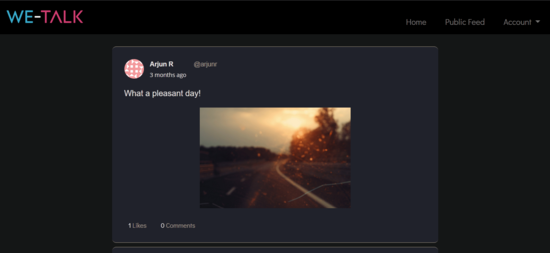
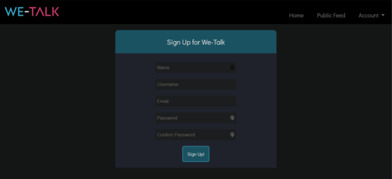
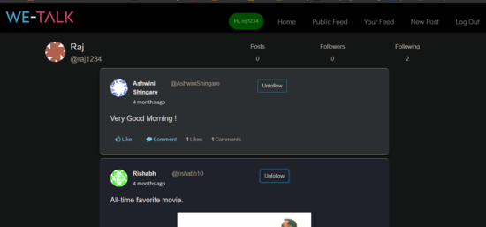
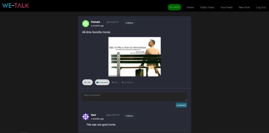
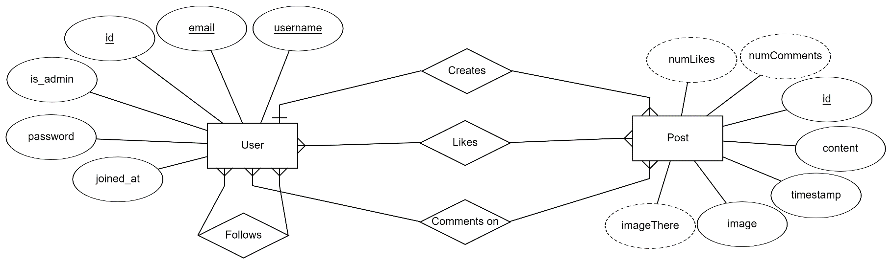
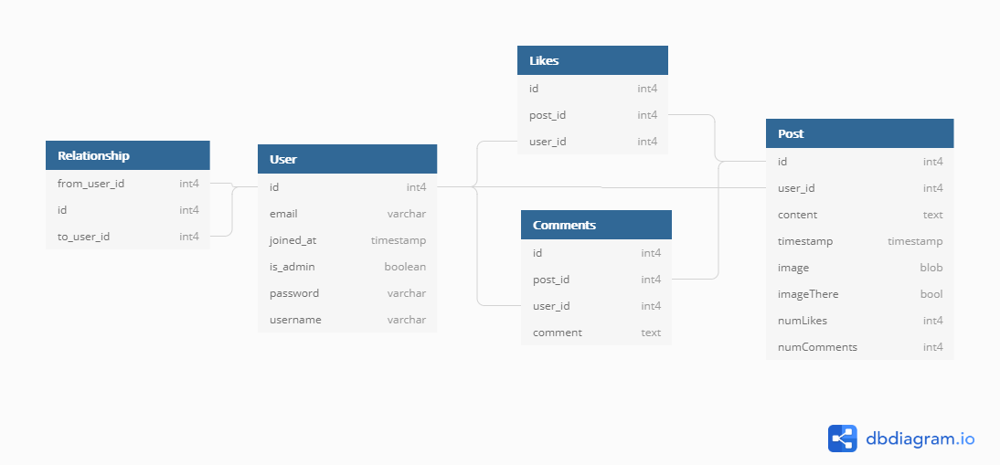

<AlertInfo><ExtLink link={"https://wetalk.rajrajhans.com"}>This project has been deployed live.</ExtLink></AlertInfo>

<Alert><ExtLink link="https://github.com/rajrajhans/wetalk">GitHub repository for this project</ExtLink></Alert>

WeTalk is a project I worked on while learning the basics of web development. It uses Flask, which is a Python Microframework, and PostgreSQL as the DBMS. WeTalk is hosted on Heroku. Following features were implemented -
1. User Authentication, User Session Management.
2. Follower - Following relationship between users.
3. Users can post posts with text content. They can also upload image with the post.
4. Users can see the posts of people they have followed in their feed. All users' posts are visible in the feed.
5. Users can like and comment on each others' posts.

Following are some screenshots of WeTalk:

 
 
 

## Database Design

Following is the Entity Relationship (ER) Diagram of WeTalk:

On an abstract level, WeTalk has two major entities, namely User and Post. There are four relationships between them – “User follows another User”, “User creates a Post”, “User likes a Post” and “User comments on a Post”.

**Entities –**

1. User

The “User” entity stores data for each user. User entity has three unique attributes – ID, Email and Username. ID was chosen as the primary key among them. Other attributes for the User entity are password, is_admin and joined_at. “is_admin” is a Boolean attribute that indicates if the user is an admin. The joined_at attribute is a timestamp that stores the user’s onboarding time.

2. Post

The “Post” entity stores data for each post made on wetalk. The primary key for Post is “id”. Other attributes are content, timestamp, and image. Post entity has three derived attributes, namely “imageThere”, “numLikes”, and “numComments”. “imageThere” indicates if the user has uploaded any image with the post, “numLikes” and “numComments” are the number of likes and comments for a post.

**Relationships –**
1. User follows User
User follows User is a recursive relationship on User entity. It is a many to many relationship as a user can follow many users and a user can be followed by many users.
2. User creates Post
User creates post is a relationship between User and Post entities. It is a one to many relationship as a user can create many posts but a post can be created by only one user.
3. User likes Post
User likes post is a relationship between User and Post entities. It is a many to many relationship as a user can like many posts and a post can be liked by many users.
4. User comments on Post
User comments on post is a relationship between User and Post entities. It is a many to many relationship as a user can comment on many posts and a post can have comments by many users.

## Converting the ER Diagram to Relational Schema

As we can see from the schema diagram, we have separate tables for keeping the record of likes and comments on each post. The likes and comments table have user_id and post_id as foreign key fields. The “Relationship” table is used to keep track of follower-following relationship between users. As we have followed the theory of database design and have kept separate tables for separate records, there is no redundancy in our database and it is in 3rd normal form, which is sufficient for practical purposes.

The deployment platform that we are using, Heroku, supports easy setup of CI/CD pipelines with triggers from GitHub repository. For example, the image above shows a pipeline set up so that every pull request on the connected GitHub repository (to merge testing branch to master branch) will trigger the creation of a “Review App”. In case the pull request is approved, that will automatically trigger a new build by Heroku and deploy it. Also, any commit on the repo’s master branch will also trigger a rebuild.

This way, we can minimize the development time that goes into deploying the app manually every time there’s a minute change.

This was a short description of the project. Thanks for reading.