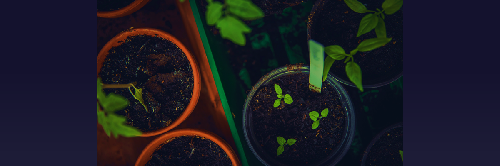

I recently stumbled upon <ExtLink link={"https://joelhooks.com/digital-garden"}>this article by Joel Hooks</ExtLink> on HN explaining the concept of a Digital Garden.

> It is a blog, sure, but it is also a spot where I can post ideas, snippets, resources, thoughts, collections, and other bits and pieces that I find interesting and useful. Instead of always being a “performance” level of blogging, it can be a looser more human endeavor that drops the idea of robots sorting the content and embraces the idea of curation, by me, for you.
> Joel Hooks

This analogy is perfect. In a real garden, you plant seeds, water them, and take care of them for the fulfillment and satisfaction that they bring onto you/give you. These plants yield fruits, of course, but the feeling of contentment while watching them grow is very rewarding.

Even though I call my site a "blog", it just refers to the reverse chronological ordering of the list of posts on the homepage. It’s not about putting up polished, heavily edited 5,000-word “showpieces”, but it’s place where I let myself grow. It's a place for writing small, opinonated posts about things that interest me and the things that I’m interested in.

Thinking about the blog in this way not only removes the pressure to be perfect, but also eradicates the worry about what others will think about a post. I just write what I want to write. Most of the things that I publish here are "how-to" instructions on how I fixed a bug, or how I developed a particular feature or simply notes on the things that I learned. The other posts are just reflections or "work in progress" thoughts. All of this opens up the possibilities to add many more things on this digital garden and I look forward to exploring more about this idea.

# Further Reading

To gain more insight into the philosophy behind the concept of a digital garden, you would want to go through the following articles -

- <ExtLink link={"https://tomcritchlow.com/2018/10/10/of-gardens-and-wikis/"}>Of Gardens & Wikis - Tom Critchlow</ExtLink>
- <ExtLink link={"https://stackingthebricks.com/how-blogs-broke-the-web/"}>How Blogs broke the Web - Amy Hoy</ExtLink>