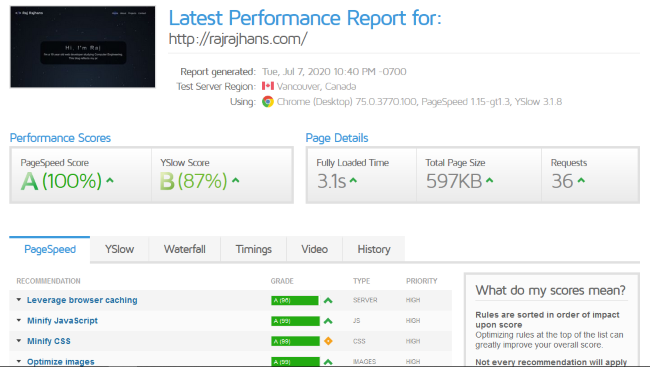
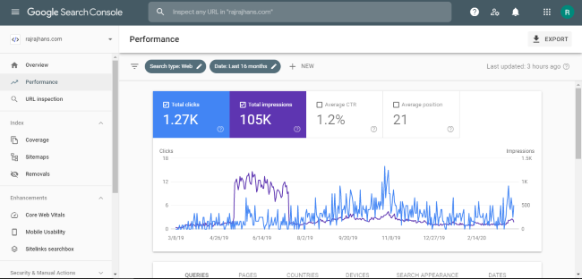
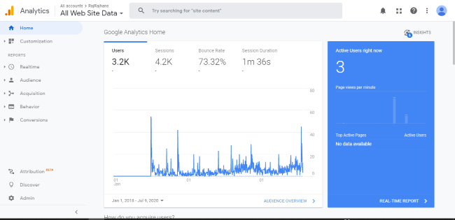

If you have a website, and someone wants to visit your website, he/she is more likely to search for it on Google/other search engines rather than typing the complete URL directly. This post is a discussion on what you can do to make sure your website appears in the search results. First, you should know how those results appear there. Search Engines crawl the internet and gather information about the content they can find on the internet to build an index. Below are the 10 basic things you should do to make it easier for Search Engines to crawl your website.

# 1. Make sure your site has relevant Meta Title and Description tags.
Meta title and Meta description exist in the header tag of your website's pages. The Meta Title tag is responsible for the page titles displayed at the top of the browser window. The meta title and meta title of the page is shown whenever the page appears as a search result. Here is an example of meta tags:

```html
<header>
    ...
    <meta name="description" content={"Meta description here"} />
    <meta name="image" content={"image_link"} />
    <meta name="author" content={"Raj Rajhans"}/>
    <meta name="keywords" content={"Raj, rajrajhans"}/>
    ...
</header>
```

# 2. Use appropriately sized and relevant meta images for every page.
You might have observed that when you share links, say on WhatsApp, you see the preview of the link with an image, that image is taken from the page's image meta tag. The recommended image dimensions for meta images are 1200x620. I will also recommend you to add the image in not only just simple meta tags but also Twitter, and OpenGraph image metatags. An example code is given below:

```html
<header>
    ...
    <meta name="image" content={"image_link"} />
    <meta property="og:image" content={"image_link"} />
    <meta name="twitter:card" content="summary_large_image" />
    <meta name="twitter:image" content={"image_link"} />
    ...
</header>
```

Use the tools mentioned below to check how your meta image will look like once shared on respective websites. Based on the results, you can optimize your content and image for better engagement on these platforms.
1. <ExtLink link={"https://cards-dev.twitter.com/validator"} title={"Twitter Cards Validator"}>Twitter Cards Validator</ExtLink>
2. <ExtLink link={"https://developers.facebook.com/tools/debug/"} title={"Facebook URL Debugger"}>Facebook URL Debugger</ExtLink>
3. <ExtLink link={"https://www.linkedin.com/post-inspector/"} title={"LinkedIn Post Inspector"}>LinkedIn Post Inspector</ExtLink>
4. <ExtLink link={"https://www.heymeta.com/"} title={"HeyMeta"}>HeyMeta (for checking general metadata)</ExtLink>

# 3. Use ALT tags for every image on your website
Always describe any image/video you are using on your site using alt tags, i.e. alternative text descriptions. This allows search engines to locate them. As a side benefit, alt tags are also helpful when an image fails to load for a user.

# 4.  Make sure your site has a sitemap.xml file
A sitemap is a roadmap that tells search engine crawlers what content is available on your website and how to reach it. It helps the crawler understand your website's structure. I have developed my website using Gatsby, a static site generator based on React. It has a simple plugin which generates the sitemap for me. You can search for plugins for your platform to build the sitemap. Use the tools mentioned below to test the sitemap of your site.
1. <ExtLink link={"https://www.xml-sitemaps.com/validate-xml-sitemap.html"} title={"Sitemap Validator"}> Sitemap Validator</ExtLink>
2. <ExtLink link={"https://seomator.com/free-tools/sitemap-test"} title={"Sitemap Test"}> Sitemap Test</ExtLink>

# 5. Optimize the performance of your website
Your website's loading speed is a very important factor in SEO. Google has made it an actual ranking factor. Depending on the platform using which your website is made, there are several methods to optimize performance. Remove anything that slows down your website. I use Gatsby, which focuses on performance and helps make blazing fast websites. Below is a performance report of this website from GTMetrix.

<ImageWrapper>



</ImageWrapper>

Use the tools below to identify issues which are slowing down your website and for suggestions on how to fix them:
1. <ExtLink link={"https://gtmetrix.com/"} title={"GTMetrix"}>GTMetrix</ExtLink>
2. <ExtLink link={"https://web.dev/measure"} title={"Web.dev"}>Web.dev</ExtLink>

# 6. Set up Google Search Console

Google Search Console is a free service from Google that helps you monitor and troubleshoot your website’s appearance in their search results. You can monitor the status of indexing done by Google on your website. Use Google Search Console to make sure your website is indexed properly. You can also inspect individual URLs on your website to find issues affecting SEO. Use <ExtLink link={"https://support.google.com/webmasters/?hl=en"}> this official guide</ExtLink> to start with Google Search Console.

<ImageWrapper>



</ImageWrapper>

# 7. Set up Google Analytics

Google Analytics is a powerful tool you can use to track the traffic on your website. Google Analytics provides in-depth insights into the traffic your website receives. You get detailed info on your site's visitors, you can also see who is visiting your site in real-time, and what pages are most visited. You can use this info to optimize the content on your website for better engagement.

<ImageWrapper>



</ImageWrapper>

# 8. Mention keywords where they matter the most

The keyword is something that is the primary focus of your website. Include this keyword (or keywords) wherever you can on your website: in the site title, site description, domain name, tagline, meta tags, page content, page URLs, image alt tags, etc.

# 9. Link to other websites with quality content

Doing this will not only help your reader with quality content, but it will also establish you as a valuable and trusted resource. You can do this in the blogs you write. I try to have a section called "Further Reading" in my blogs with links to other blogs with relevant and quality content that can be helpful for the readers.

# 10. Build momentum for your website on social media

Lastly, share the links for the article and your website on your social media, as it will help with your link-building, which is an important factor to improve SEO. You can share your articles on Twitter, LinkedIn, WhatsApp to get more incoming traffic to your website. This incoming traffic from social sources will be tracked by Google Analytics to help you understand how your posts are performing.

Those were the ten important and practical things to be mindful of when working on your website. If you follow them well, it will definitely boost your SEO and increase the chances of your website showing up in search results. Thanks for reading.
