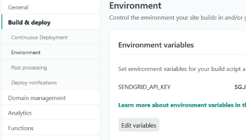

I recently redesigned this website using <ExtLink link={"https://rajrajhans.com/2020/07/what-is-gatsby/"} title={"What is GatsbyJS"}>GatsbyJS</ExtLink>. Gatsby sites are static sites based on JAMStack.  I wanted to add a contact form to my site, but as you know, there is no back end system in a Gatsby site. So, how to implement a contact form that will need to send emails of the responses received?

One way to do that is by using <strong>lambda functions</strong>. Your form can invoke a URL endpoint, which, when called, executes the function that you wrote. In other words, lambda functions allow you to create API endpoints without setting up a server. This opens up a plethora of possibilities to make "dumb" static sites dynamic without any need of a backend server. Netlify runs these functions on AWS Lambda, and you don't need to worry about the complexities of AWS as Netlify takes care of it for you.

Netlify functions give us sufficient quota in the free tier. You can run 125,000 function calls with up to 100 hours of runtime per month. It has 128MB of memory and, each function can execute for up to 10 seconds. This is more than enough for me.

So, I had to create an endpoint which will get called upon form submission and accept the form data as input and use SendGrid API to send the form data to me via email.

# Step 1: Set up Netlify Functions with Gatsby

You can add Netlify functions to Gatsby in 5 steps which are described in detail in the documentation here. I'll just give a summary of those 5 steps below:
1. Install required dependencies.
2. Change `scripts` in `package.json`.
3. Configure Netlify build in `netlify.toml` file.
4. Set up proxy middleware for local development.
5. Write your functions in the `src/functions` folder.

# Step 2: Add functions as JS files

After going through these five steps, you have to add all your functions as .js files in the `src/functions` directory. We've to follow certain rules for writing functions. Each file must export a <strong>handler</strong> method with three arguments: event, content, and callback. Following is the general syntax to be followed:
```javascript
exports.handler = function(event, context, callback) {
    // your server-side functionality
}
```
- <strong>Event</strong>: contains information about the request - request body, request headers, etc
- <strong>Context</strong>: contains the details about the context in which the function was called, example: Netlify Identity user information.
- <strong>Callback</strong>: Similar to AWS Lambda's `callback`. This is the function that is called to return the error (if there's any) or the response object.

Netlify provides the `event` and `context` parameters when the function is invoked. We provide the `callback` parameter.

# Step 3: Install & Set up SendGrid

You will need to create a free account with SendGrid, and get an API key. Next, we will set our SendGrid API Key as an environment variable in Netlify. To set environment variables, go to your Netlify site dashboard, click on Settings, then "Build & deploy" and then "Environment".



Then, we install the SendGrid mail package.
`npm install --save @sendgrid/mail`

Now, let's take a look at our function sendmail.js

```javascript
// src/functions/sendmail.js
const sgMail = require('@sendgrid/mail');
sgMail.setApiKey(process.env.SENDGRID_API_KEY);

exports.handler =  async (event, context, callback) => {

  const data = JSON.parse(event.body)
  const { email, subject } = data

  const body = Object.keys(data).map((k) => {
    return `${k}: ${data[k]}`
  }).join("<br><br>");

  const mail_to_send = {
    to: "me@rajrajhans.com",
    from: email,
    subject: subject ? subject : 'New Entry from Contact Form',
    html: body,
  };

  try{
    await sgMail.send(mail_to_send)

    return {
      statusCode: 200,
      body: "Message sent successfully"
    }
  } catch(e){
    return {
      statusCode: e.code,
      body: e.message
    }
  }
};
```
The code is pretty straight forward. First, we set the API Key as specified according to SendGrid documentation, then, we collect the form body which has been sent as JSON, make the object "mail_to_send", and send it. You might have noticed we have used `async/await` instead of a normal call. One thing to note is that when you use async await in a Lambda Function, there is no need to use a callback function, you just return the response object. In this code, we are returning "Message Sent Successfully" if everything goes right and if there's any error, we return the error.

Now that our function is ready, we will go ahead and create a Contact Form in Gatsby using React.

First, the HTML part:

```html
<form onSubmit={this.handleSubmit} class={"contactForm"}>
    <h2>Drop a message</h2>
    <p type="Name:">
      <input required placeholder="What's your name?" name={"name"} type={"text"} value={this.state.name} onChange={this.handleChange}/>
    </p>

    <p type="Email:">
      <input required placeholder="How shall contact you back?" name={"email"} type={"email"} value={this.state.email} onChange={this.handleChange}/>
    </p>

    <p type="Subject:">
      <input required placeholder="What is this regarding?" name={"subject"} type={"text"} value={this.state.subject} onChange={this.handleChange}/>
    </p>

    <p type="Message:">
      <textarea required placeholder="How can I help?" rows={3} name={"message"} value={this.state.message} onChange={this.handleChange}/>
    </p>

    <button type={"submit"}>Submit</button>
</form>
```
Next, the handleChange function:
```javascript
handleChange(e){
this.setState({
  [e.target.name]:e.target.value,
})
}
```
Then we look at the handleSubmit function where we actually send the email containing form data
```javascript
async handleSubmit(e){
    e.preventDefault();

    const {name, email, subject, message} = this.state;
    const to_send = {
      name: name,
      email: email,
      subject : subject,
      message : message
    }

    try{
      const response = await fetch("/.netlify/functions/sendmail", {
        method: "POST",
        body: JSON.stringify(to_send),
      } )

      if (!response.ok){
        //Do something when request fails
        return
      }
      //Do something when request is successful
    } catch (e) {
      console.log(e);
    }
}
```
As you can see, the function is pretty straight-forward. The above code is a skeleton, you can put in the code for whatever you want to do when sending the mail fails or is successful. I have implemented a CSS spinner while the fetch request is going on, and then a message is shown depending on whether the request has failed or not. You can see the complete code of my contact form <ExtLink link={"https://gist.github.com/rajrajhans/fbb916adfbaa9994df16e1e4796e9c80"}>here</ExtLink>.

That's it for this post, I plan to make another post on integrating reCaptcha to avoid spam in the near future, so stay tuned!

# Further Reading

1. <ExtLink link={"https://docs.netlify.com/functions/build-with-javascript/"}>Netlify Functions Documentation</ExtLink>
1. <ExtLink link={"https://www.gatsbyjs.org/blog/2018-12-17-turning-the-static-dynamic/"}>Gatsby Official Blog: Turning the Static Dynamic</ExtLink>
