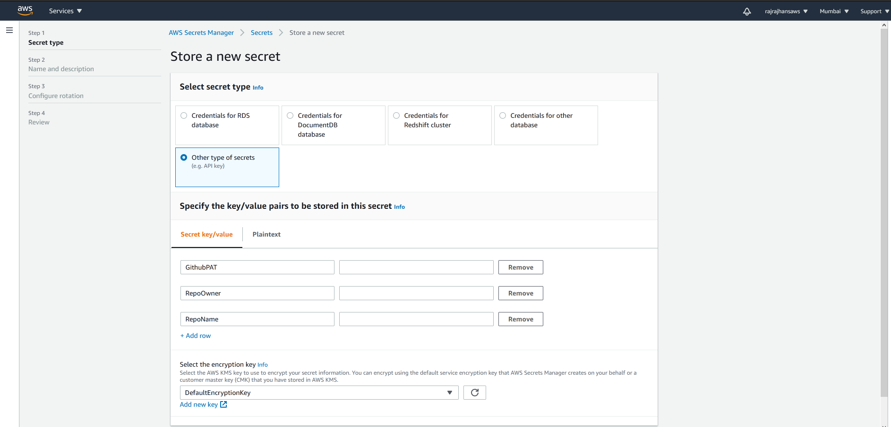
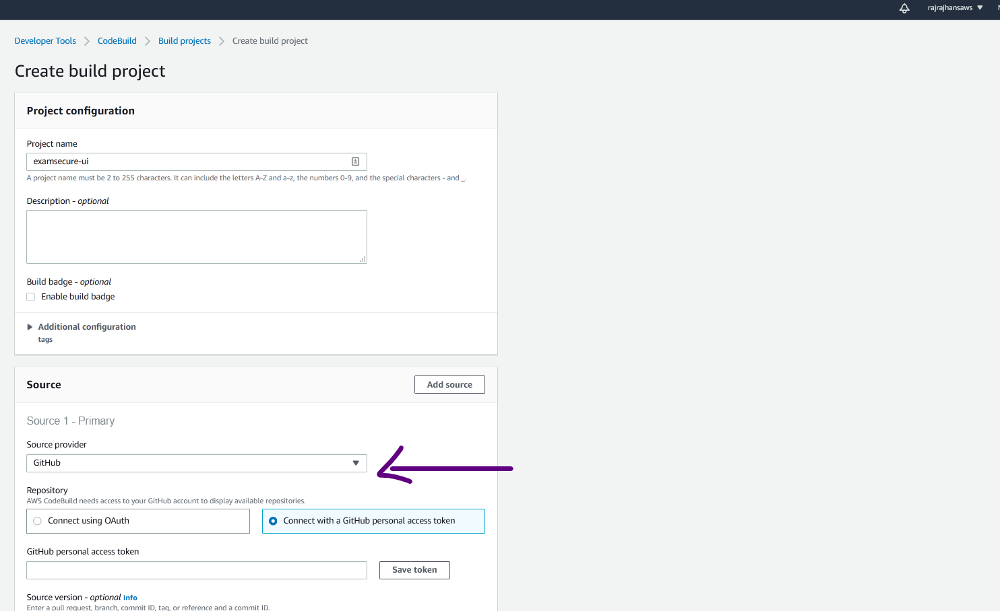
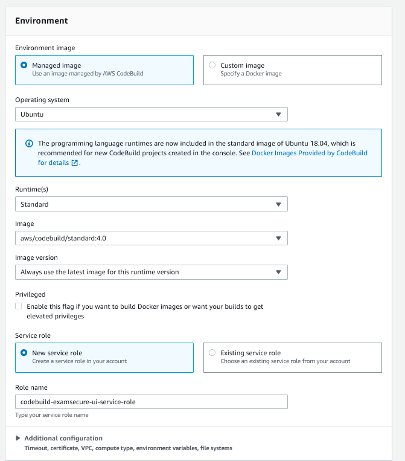
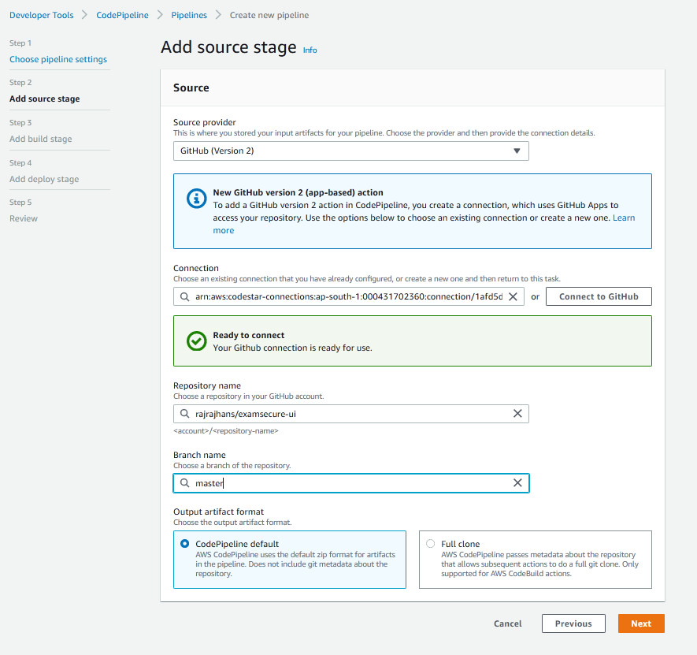
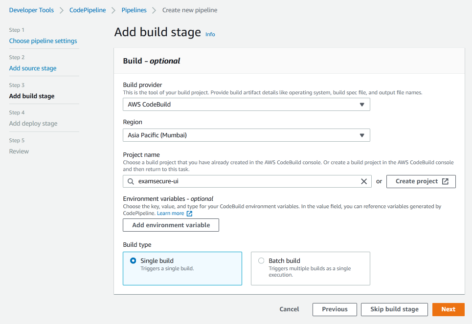

# The Problem

Recently, I have been working on a project with a static site developed using React as it's frontend. The rest of the project uses AWS services heavily, so I went with S3 for hosting the static React frontend, and a CloudFront distribution as a CDN ahead of it. Each time I wanted to push a deploy, I had to manually upload all the build files to the S3 bucket and also ensure there was some versioning involved since CloudFront effectively caches your site and if you push something new, you have to invalidate the old cache. Doing this every time I wanted to push was a headache, so I set up a simple CI/CD pipeline that automates all this.

# Hold on, what’s CI/CD?

CI/CD (Continuous Integration / Continuous Delivery) automates the deployment process. A CI/CD pipeline can build, test and deploy the code automatically each time we “do something” (this may be committing to the repo / making a pull request, etc). CI is the process of building our code and running any unit tests on it. This ensures there is no integration error due to the new changes. In CD phase, the code is deployed after running additional tests.

In my case, the project was in initial stages and there were no tests involved, so all I had to do was automate the build and deploy parts. In this post, I have documented how I did this.

# The Solution

First off, let’s see what our requirements are. What do we need to automate? Well, when a commit is pushed to a repository, we expect our pipeline to –

1.	Build the React code using configuration mentioned in package.json
2.	Upload these build files to our S3 bucket (it should replace the previous files)
3.	Our CloudFront distribution should somehow be aware of these changes are start serving the new files instead of the old ones.

Alright, let’s get into the specifics now. We are going to use <ExtLink link={"https://aws.amazon.com/codepipeline/"}>AWS CodePipeline</ExtLink> to achieve these goals. It is a CD service. It automatically triggers when you update the source repo and passes the changes we did through 3 stages.

1.	<strong>Source Stage</strong> - Here, it pulls the new changes from our repo.
2.	<strong>Build Stage</strong> – Here, it installs dependencies and builds our code. If you want to do any automated tests, you can do them here. We will be using CodeBuild for building our code
3.	<strong>Deploy Stage</strong> – Here, it deploys the changes to our production environment.



Instead of AWS CodeCommit (which is a git service by AWS), we will be using GitHub as the Source for our code.

Also, I already had a S3 bucket and a linked CloudFront distribution ready. If you don’t, follow this link for instructions for the same.

Note: Make sure you make the CodePipeline in the same region that you’re s3 bucket is. I made a mistake of creating them in two separate regions, and then had to delete it and create again!

__Step 1__: Make sure you have updated code in your GitHub Repo

__Step 2__: Create a new <ExtLink link={"https://docs.aws.amazon.com/codebuild/latest/userguide/create-project.html"}>CodeBuild</ExtLink> project.

Select the “Source” as GitHub. You have options to Connect using OAuth or using the Github Personal Token we just created. After you connect, you can enter the Repository URL.



Once the repository is connected, we can specify the Environment settings. You can go with the default ones suggested by AWS without facing any issue. Following is what I selected –



Next, you have to specify the Build Specifications. This is the part where the whole magic is going to happen. When it spins up a CPU instance for us with the specified environment, it has to “do something” (for example – executing npm <strong>run build</strong>) to actually build our project. That “doing something” part is specified in the BuildSpec.

CodeBuild automatically detects a buildspec.yml file from your project root and takes that as the build specification. Let’s understand the buildspec used in our case.

The specification includes four phases –
1.	__Install__
    * Getting the specified environment set up
2.	__pre_build__
    * Final commands to execute before build
    * In our case, this will be running npm install to install all our dependencies
3.	**build**
    * actual build commands
    * In our case, this will be `npm run build`
4.	__post_build__
    * any cleanup tasks
    * In our case, we will push the resulting build files to S3 and tell our Cloudfront distribution to invalidate index.html and service-worker.js, which will make sure that Cloudfront distributes our latest files.

Following is the `buildspec.yml` file that I used. You can see the comments to get an idea about what each individual command does.

```html
version: 0.1
phases:
  pre_build:
    commands:
      - echo Installing source NPM dependencies...
      - npm install
  build:
    commands:
      - echo Build started on `date`
      - npm run build
  post_build:
    commands:
      # copy the contents of /build to S3

      - aws s3 cp --recursive --acl public-read ./build s3://edi-ty52-webuibucket-u9l4ezvzdnvt/

      # set the cache-control headers for service-worker.js to prevent browser caching

      - >
        aws s3 cp --acl public-read
        --cache-control="max-age=0, no-cache, no-store, must-revalidate"
        ./build/service-worker.js s3://edi-ty52-webuibucket-u9l4ezvzdnvt/

      # set the cache-control headers for index.html to prevent browser caching

      - >
        aws s3 cp --acl public-read
        --cache-control="max-age=0, no-cache, no-store, must-revalidate"
        ./build/index.html s3://edi-ty52-webuibucket-u9l4ezvzdnvt/

      # invalidate the CloudFront cache for index.html and service-worker.js to force CloudFront to update its edge locations with the new versions

      - >
        aws cloudfront create-invalidation --distribution-id E3552Z2O0OJKV0
        --paths /index.html /service-worker.js
artifacts:
  files:
    - '**/*'
  base-directory: build
```

After this, the last step is to select your S3 bucket as the “Artifact”

After these steps, click on “Create Build Project”.

Great! Now our build project is ready. Let’s actually create a pipeline using CodePipeline which will use this build project we have created.

__Step 1__ – Create new Pipeline by going to CodePipeline > New Pipeline

__Step 2__ – Choose basic pipeline settings like Name, description, etc.

__Step 3__ – Add Source Stage. Here, we will select our Github Repo. Here is a screenshot of this step completed



__Step 4__ – Add Build Stage
* In this stage, you have to select the CodeBuild project we just created previously. You can also mention any environment variables your project might need.
* You can skip deploy stage, since we have already included pushing files to s3 and invalidating Cloudflare cache in the post build step of our CodeBuild project.

After creating the pipeline, it will get triggered and run for the first time. After it has run, you should see something like this –



If you face any errors at this stage, ensure two things –
1.	Your app build without any errors on your PC
2.	The “CodePipeline” and “CodeBuild” Service Roles have been given the required permissions to access your S3 bucket. To ensure this, you can go to AWS Management Console Home > IAM and grant the required permissions

That’s it. We are done! After this, whenever you will push to your repo, the CodePipeline we just created will get triggered, build our project using the CodeProject, and deploy to S3 and CloudFront. Pretty cool, isn’t it!

Hope this was helpful, thanks for reading!

# References

1. <ExtLink link={"https://aws.amazon.com/blogs/devops/complete-ci-cd-with-aws-codecommit-aws-codebuild-aws-codedeploy-and-aws-codepipeline/"}>AWS Blog on CI/CD using CodeBuild and CodePipeline</ExtLink>
