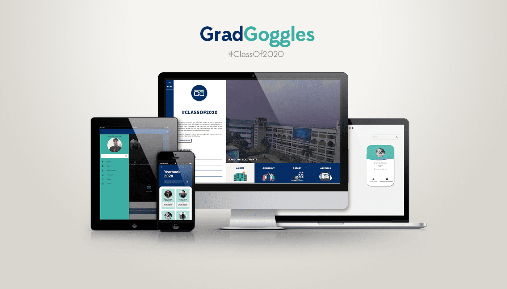
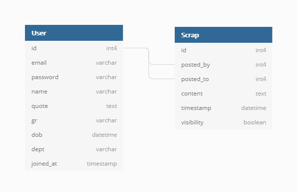
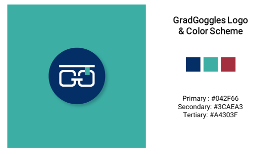
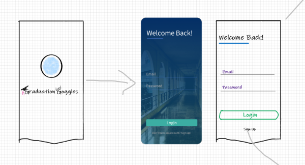
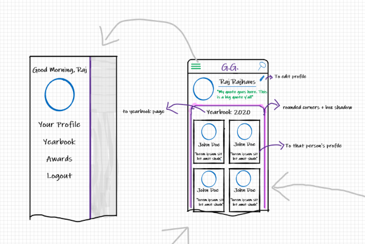
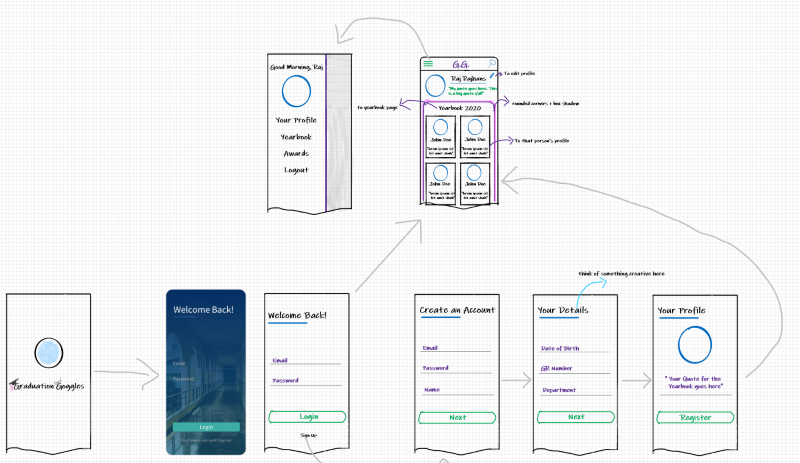
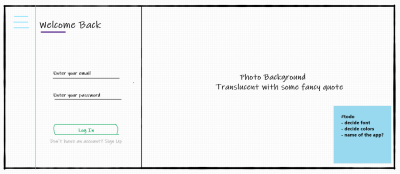
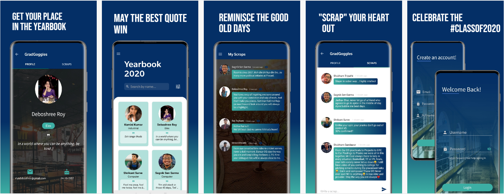

<AlertInfo><ExtLink link={"https://gradgoggles.com"}>Visit gradgoggles.com to check out the project.</ExtLink></AlertInfo>

<AlertInfo><ExtLink link={"https://play.google.com/store/apps/details?id=com.team.android.gradgoggles&hl=en"}>The GradGoggles Android App is now live on the Google Play Store!.</ExtLink></AlertInfo>

# The Problem

The pandemic has affected each and every part of our lifestyle in a major way. Those who have had it especially difficult are the students who are in the final year of their study. While we cannot do anything about the uncertainties  whether their exams will be conducted, we identified one problem that we can attempt to solve. Every final year batch gets a grand farewell from their juniors, celebrating their foray into the real world. There's the yearbook with quotes of each student which will serve as a source of nostalgia years down the line. There's a Scribble Day where students reminisce the best parts about the journey they have had in these four years. The Class Of 2020 missed it all.

# The Solution

"Developing an application that will facilitate virtual yearbook and scrapbook." - That's the simple problem statement we started with. The Yearbook will contain all the students of the #ClassOf2020. Each student will have his/her profile. Each student can post "scraps" on other's profiles, which the other can choose to display to everyone on his/her profile.

# The Process

In this section, I will try to elaborate on the process we followed in developing the application. The design plus development took about 45 days, followed by a beta rollout and subsequent bug fixing.

## 1. Establishing goals and features based on requirements

As the purpose of the application is decided, we now move to define the features. Following is the list of features that the application should support.
- While signing up, the user will provide his/her details like Name, Email, Department, Year, Profile Photo, GR Number, and Yearbook Quote.
- User's email will be verified by sending a token which will expire in an hour. A user can browse the yearbook but can only post scrap if his/her email is verified. (This was done to protect users from spam)
- Once registered, the user can browse the yearbook which consists of other students of the graduating class.
- Users can also post a scrap on other user's profiles. If a user A posts scrap on user B's profile:
    - User B will be sent an email notification saying that user A has posted scrap on his profile.
    - By default, that scrap will not be visible to anyone except user B. He can make it visible so that it will be shown on his profile when other users see it.
    - User B can choose to delete the scrap as well.
- User should be able to change his name, password, and other details. He should also be able to reset his password using email in case he forgets it.

## 2. Selecting the technologies

We planned on having a web app using ReactJS, and an Android app. So, having a central API which both Android client and React WebApp can use made sense. Following is a list of technologies that were used.
- <b><ExtLink link={"/tags/react-js"} title={"ReactJS Posts on rajrajhans.com"}>ReactJS</ExtLink></b>: For developing the webapp, React was an obvious choice since we were already familiar with it and the performance benefits, better user and developer experience were an added bonus.
- <b><ExtLink link={"/tags/flask"} title={"Flask Posts on rajrajhans.com"}>Flask</ExtLink></b>: Flask, which is a microframework in Python, was used for the API. Flask was preferred over Django since it is lightweight and gives you more control over the project. Also, many of the things that Django provides out of the box were simply not needed. JWT-based authentication (JSON Web Tokens) was implemented for authentication between the client and the API using the <ExtLink link={"https://flask-jwt-extended.readthedocs.io/en/stable/"}> Flask-JWT-Extended</ExtLink> library.
- <b><ExtLink link={"/tags/heroku"} title={"Heroku Posts on rajrajhans.com"}>Heroku</ExtLink></b>: Heroku was used for deploying the Flask API as well as the ReactJS web app. We used the Hobby Dyno for both the API and webapp. PostgreSQL, provided by Heroku, was used as the DBMS. Heroku helps simplify the deployment process while also offering convenient features like Continous Deployment from GitHub. You can read my post <ExtLink link={"/2019/11/deploying-flask-webapp-heroku/"}>"Deploying your Flask WebApp to Heroku for the World to see"</ExtLink>, in case you are interested.
- <b><ExtLink link={"/tags/amazon-s-3"} title={"AWS S3 Posts on rajrajhans.com"}>AWS S3</ExtLink></b>: AWS S3 was used for static storage of user-uploaded images for profile photos. AWS is fast, which helps in improving performance. Instead of sending the user profile image to S3 through the API, we made the client upload the image to S3 itself and send the uploaded image's URL to the API. This reduced the API server's load significantly and helped increase performance. You can read more about it <ExtLink link={"/2020/06/2-ways-to-upload-files-to-s3-in-flask/"} title={"2 ways to upload files to Amazon S3 in Flask"}>here</ExtLink>.
- <b>Java</b>: Java was used for developing the android app.

## 3. Database Design

In the system, there are two major entities - Users, and the Scraps they post. You can see the diagram below to get a clear idea of the database design.

The posted_by and posted_to attributed in the Scrap table are foreign keys referencing the id attribute in the User table. This simple design with two tables allows us to query any desired data easily.

## 4. UI / UX Design

It was important to have a simple yet effective design system that would be followed everywhere to ensure consistency. We started with developing basic low fidelity wireframes of the App and WebApp. Below are a few images that show the UI UX design process we followed. Credits to <ExtLink link={"https://www.instagram.com/swarajthamke"}>Swaraj Thamke</ExtLink> for the amazing logo design!

## 5. Developing and Documenting the API

The API was developed using Flask in Python. I have described various stages of developing the API below:

- **Authentication**: Generally, you can implement authentication on the web either using Sessions or using JWT (JSON Web Tokens).

    - *Session-based Authentication*: Server creates a session for the user after the user logs in. The sessionID is stored on a cookie in the user's browser. SessionID is then sent along with every request to the server to verify identity as long as the user is logged in. This method is stateful in the sense the server is responsible for maintaining the client state.

    - *Token-based Authentication*: Server creates a JSON Web Token (JWT) for the user when he logs in. The JWT contains the user's identity. The client includes the JWT as a Authorization header with every request to server to prove identity. This method is stateless in the sense the user state is stored inside the token which resides on the client's local storage in the browser. Unlike session based auth, the server does not store user state.

Which one to choose between the two? We went with Token Based Authentication because of the following reasons -
1. **JWT works well with multiple clients** - Session based auth uses cookies. Cookies can create a problem since Cross Domain (3rd Party) cookies are blocked by browsers. So, if the domain of API and Client is different, it will cause a problem. Since JWT is attached in the header of the request, it creates no such problem.
2. **JWT is more scalable** - as you don't have to store the user state on server. If the number of users becomes huge, then you would need more server storage for session based auth.

One thing to take care of while using JWT is that they are not secure, so we should NOT include any sensitive information in the JWT. Only public information should be included.

- **Deciding on Resources and Endpoints**: We tried to follow the REST API spec, which, to summarise, advises that we should focus on "things" rather than "actions" while creating endpoints. We divided the endpoints into broadly three categories -
1. Authentication - responsible for User Login, Signup, Password Reset, Password Change.
2. User - responsible for everything related to user data and user's scraps. (GET, POST, PUT, DELETE)
Each endpoint was then developed accordingly.

- **Emails**: The API was also responsible for sending verification, notification and password reset emails to the users. Earlier, we used SendGrid's API as our email service while development. Later, we used Bigrock's (our domain registrar) SMTP servers to send the emails. SendGrid's template designer helped to create attractive branded email templates.
  For email verification, the API generates a time-limited token using <ExtLink link={"https://itsdangerous.palletsprojects.com/en/1.1.x/url_safe/"}>itsdangerous's URLSafeTimedSerializer</ExtLink>. This token is then used to make a link and sent to the user via email. When the user clicks on that link, he is directed to another endpoint on the API which accepts the token in the URL parameter, and validates it. If it is valid, the user is marked verified in the database.

We used SwaggerHub to document the API. SwaggerUI provides easy and fast API documentation.

## 6. Deploying the API

We used Heroku to deploy our app. We use Heroku supported gunicorn web server to deploy the app. I have covered deploying a Flask app on heroku in a separate post here - <ExtLink link={"/2019/11/deploying-flask-webapp-heroku/"}>"Deploying your Flask WebApp to Heroku for the World to see"</ExtLink>

## 7. Developing the ReactJS WebApp

Simultaneously, we were developing the WebApp as well. We used Material UI for convenient styling. After the UI design was finalized, actual development work started. We also used React Router DOM for routing.

Implementing user authentication using the API was a little bit tricky. The JWT token received from the API was stored in the browser's localStorage. Along with the token, we are storing the user's ID, and some other identity info in the localStorage so that frequently needed public data could be loaded quickly. Based on whether the user is logged in, certain routes were protected. If the user is not logged in, he was directed to the login page.

To decide whether the user is logged in or not, the webapp would check the client's localStorage. If the user is logged in, the JWT would be present. However, there was a chance that a malicious actor may insert his own JWT just to bypass the login check. So, checking whether the user is logged in purely based on the existence of JWT in localStorage was not a good idea. So, we would also validate the JWT by making a call to the API. And, once the user logs out, all the data from localStorage would be removed.

Other than this, most of the development of the WebApp was developing the user interfaces using the corresponding API endpoints.

**Android Client**: We have just submitted our Android app to Play Store and it is currently under review by Google Play Store :)

<strong>Update:</strong>: <ExtLink link={"https://play.google.com/store/apps/details?id=com.team.android.gradgoggles&hl=en"}>The GradGoggles Android App is now live on the Google Play Store!.</ExtLink>

# Challenges and Learnings

- **Storing User Uploaded Photos**: Storing the images in the database (as binary data) was not an option - since it will put a tremendous load on the database and lead to a performance nightmare for large-sized images. So, we decided to use Amazon S3 for static storage. Earlier, we were sending the images to API from the client, then the API was uploading it to S3. To optimise the process, we decided to upload the image to S3 directly via the client, and only send the uploaded link to API. This helped reduce the load on the API. This happens in the following steps -
1. User selects a file to upload.
2. Client makes a request to the API. The API produces a temporary signature with which to sign the S3 upload request and returns it to the browser as JSON.
3. Client then uploads the file directly to Amazon S3 using the signed request supplied by our API. The upload takes place asynchronously, and user is displayed his/her uploaded image. On clicking submit, only the URL of the uploaded image gets sent to our Flask API.
If you want to learn more about it, check out <ExtLink link={"/2020/06/2-ways-to-upload-files-to-s3-in-flask/"} title={"2 ways to upload files to Amazon S3 in Flask"}>this post</ExtLink>.

- **Cross Browser Date Format Issue**: In our WebApp, we fetch the date from the API in a specific format and the WebApp displays it after converting it to the desired format. This "converting" happens in the client's browser using JavaScript. Everything was working fine, but, one of the beta testers complained that dates weren't visible properly. Safari, for some reason, was displaying "NaN". Turns out, Safari has a history of problems with Date formats. So, we used moment.js to sort out the problem.

There were countless other minute challenges that we faced but solving them helped us learn many things which can only be learned by getting one's hands dirty.

That's it for this post, I hope it was informative. Projects like these really teach a lot. Also, it feels nice when actual users are using and enjoying something you made. I hope you enjoyed reading this (rather long) post. Thank you, and stay safe!
