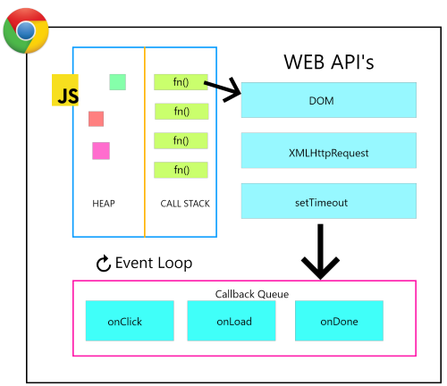

> It's impossible to effectively use any abstraction if you don't understand what it's abstracting, and why
> <span>Kyle Simpson (Author of You Don't Know JS)</span>

Are you wondering why your setState is setting the state as 'undefined' after pulling data from using an API call? Well I certainly was, and when I found out that setState calls are actually asynchronous and that's when I decided to learn more about asynchrony in JS. These are some of my notes of the same taken from various sources listed at the bottom of this post. If you want to dive into this topic in detail, I would highly recommend Kyle Simpson's "YDKJS: Async & Performance" Book.

Note that, this article is incomplete in it's current state, I will be updating it with more topics as I go on learning more. :)
Alright, let's get started.

# What does "asynchronous" really mean in JavaScript?

Before starting, I highly recommend you to read <ExtLink link={"/2020/08/concurrency-vs-parallelism-vs-asynchrony/"}>this post on Concurrency vs Parallelism vs Asynchrony</ExtLink>. It will help you clear up any confusion between these three, often misunderstood, terms.

JavaScript is single-threaded, meaning you cannot run two lines of code at once (without web workers or something like that). So, JS is not truly concurrent, but it can be asynchronous. We can "pretend" that some things happen concurrently instead of waiting for them to finish. What happens is your main script executes normally, and then continuously runs any code that we wanted to run "asynchronously". Asynchronous just means that the code isn't run in the order it's laid out. So, in JS, Concurrency is when two or more chains of events interleave over time, such that, from a high level perspective, they appear to be running simultaneously, when in fact, what's happening is fast context switching . This works using an "event loop".

<ImageWrapper>



</ImageWrapper>

# The Event Loop

JavaScript Engines have no innate sense of "time", but instead are driven by "events". As we know, JS is a single threaded language, so it has a single call stack which keeps track of what function we are currently executing and what function to execute after that. And, at a given time, it can execute one and only one piece of code. Now, say, you add a setTimeout, so it has to count the time, but if it does that how will it process the other code? Won't the other code get blocked while waiting for the time counter to end? The thing, is, when you call a setTimeout function (or do any other async operation), it is added to an "Event Table" provided by the browser's Web APIs. So, Javascript's main call stack has nothing to do with it, it just adds it to the Web API Event Table.

The job of the Web API event table is to keep track of events and send them to the Callback queue once the event is fired. Let's take example of setTimeout.

```javascript
setTimeout(function timeout() {
   console.log("Hello!");
}, 5000);
```

When JavaScript (call stack) stumbles upon this piece of code, it hands it over to the Web API Event Table, which keeps track of the timer. Now, when 5 seconds have passed, the event is triggered and the Web API sends the callback function to the callback queue. When the call stack is empty, it is the job of the event loop to take things from the Callback queue and put them on the top of the Call Stack, ready for execution by JavaScript. So, a thing to note here is the code with setTimeout of 5s isn't guaranteed to run exactly after 5 seconds, but you can be sure that it will definitely not run before 5 seconds.

If you want to understand the event loop more clearly, I would recommend the two talks I have mentioned in the "Further Reading" section of this post at the bottom. Also, there is an excellent tool called "Loupe" by Philip Robert which will help you visualize what actually goes on under the hood.

Now that we understand how asynchrony is handled under the hood, lets look into how we can use asynchrony in the language.

# Callbacks

Callbacks are functions passed to another functions as arguments, which are then invoked inside the outer function. Callbacks are the most fundamental and oldest async patterns in the language. However, they are considered to be very messy in implementation, as you might have heard the term "callback hell". Why? let's take an example -

```javascript
listen( "click", function handler(event){
  setTimeout( function request(){
    ajax("http://example.com/api", function response(text){
      if (text == "hello"){
        handler();
      }
      else if (text == "world"){
        request()
      }
    } );
  }, 500);
} );
```

First, we are waiting for the "click" event, then we are waiting for the timer to fire, and then we are waiting for the Ajax response to come back, at which point it might do it all again. If you try to go over the code to understand what is exactly happening, you will understand that it's a bit convoluted. And, here the code is given in simple steps, in real code bases, it's significantly more complicated than this. That's the major problem with callbacks - its difficult to understand them and predict what's happening.
1. It's difficult to read because of it's lack of sequentiality.
2. Callbacks suffer from inversion of control in that they implicitly give control over to another party (often a third-party utility not in your control) to invoke the continuation of your program. can you trust it to run your continuation code properly (not more than once, at least once, and so on)?
    1. In real world, it might have disastrous consequences, let's say you provide a function which charges the user's credit card as a callback to another function, what if the callback is executed twice? The user's credit card will get charged twice!

So, it's clear that we need something better, sophisticated than callbacks for handling async flow.

# Promises

The concept of "Promise" in JavaScript resembles to that of an "IOU" in real life. For example, lets say you are in a burger joint, you pay for your burger and the cashier hands you a receipt. That receipt represents the promise of a burger, something that you will have in the future.

A Promise is an object that may produce a single value some time in the future, that value can either be a resolved value, or the reason it failed. A promise can be in one of three possible states: Pending, Fulfilled, or Rejected. Based on whether the promise is fulfilled or rejected, appropriate code is called and executed. A promise is said to be "settled" if it is not pending. Once settled, a promise can't be resettled. Thus, promises, once resolved are immutable and retain their same resolution (fulfillment or rejection) forever, and can subsequently be observed as many times as necessary.

The concept of Promise is different from callbacks. In callback, we provide a function to execute after some task is done. In Promises, we wait for the task to happen and just return an "event" which says if the task has been executed successfully or not. Then, based on that "event", we do appropriate things ahead. This separation of concern not only solves the inversion of control problem, but also brings a subtle sequentiality to the code, making it easier to read.

```javascript
var p = new Promise( function(X,Y){
    // X() for fulfillment
    // Y() for rejection
} );
```

A few points to note:

- When you call `then(..)` on a promise, even if that Promise was already resolved, the callback you provide to `then(..)` will always be called asynchronously.
- Every time you call `then(..)` on a Promise, it creates and returns a new Promise, which we can chain with.
- Whatever value you return from the `then(..)` call's fulfillment callback (the first parameter) is automatically set as the fulfillment of the chained Promise (from the previous point).
- Inside the fulfillment/rejection handlers, if you return a value or an exception is thrown, the new returned (chainable) Promise is resolved automatically.
- If the fulfillment or rejection handler returns a Promise, it is unwrapped, so that whatever its resolution is, will become the resolution of the chained Promise returned from the current `then(..)`

Now, let's take a look at how Promises are handled internally.

# The Microtasks Queue

Promises don't use the normal event callback queue, but instead use the microtask queue a.k.a. the jobs queue. Tasks in the jobs queue will run when the call stack task is done with the current task at hand (even though there are more tasks waiting in the call stack). The callback queue is like an amusement park ride. When you finish the ride, you go back to the back of the line to ride again, but the jobs queue is like finishing the ride, but then cutting in the line and getting right back on. So, the promise callbacks will automatically be fired at the next available asynchronous moment instead of waiting for the call stack to be free.

That's it for right now. I will update this post with async/await, and other topics as I get to them. Thanks for reading and I hope this was helpful for you. Onwards and Upwards :)

# References
1. <ExtLink link={"https://www.youtube.com/watch?v=8aGhZQkoFbQ "}>"What the heck is the event loop anyway?" by Philip Roberts</ExtLink>
2. <ExtLink link={"https://www.youtube.com/watch?v=cCOL7MC4Pl0"}>"In the Loop" by Jake Archibald</ExtLink>
3. <ExtLink link={"https://www.amazon.com/You-Dont-Know-JS-Performance/dp/1491904224"}>You Don't Know JS: Async & Performance - Kyle Simpson</ExtLink>
