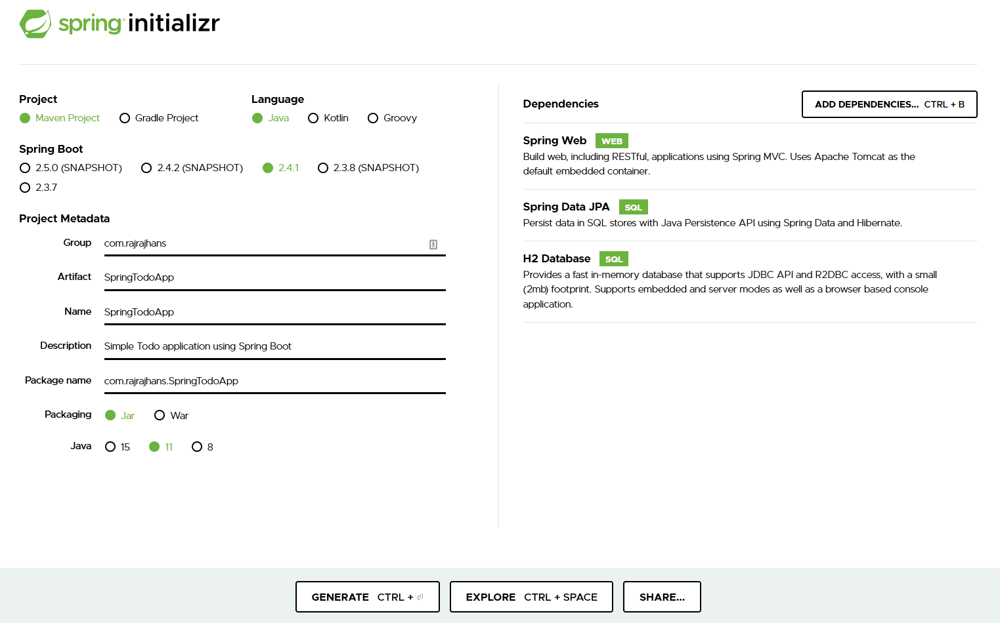
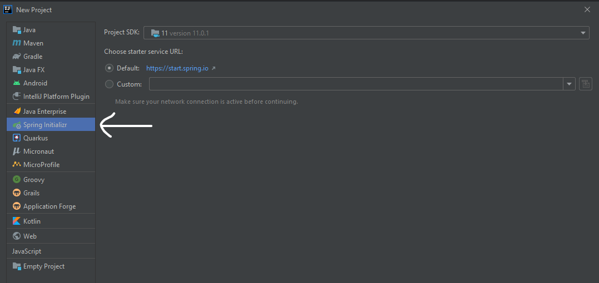
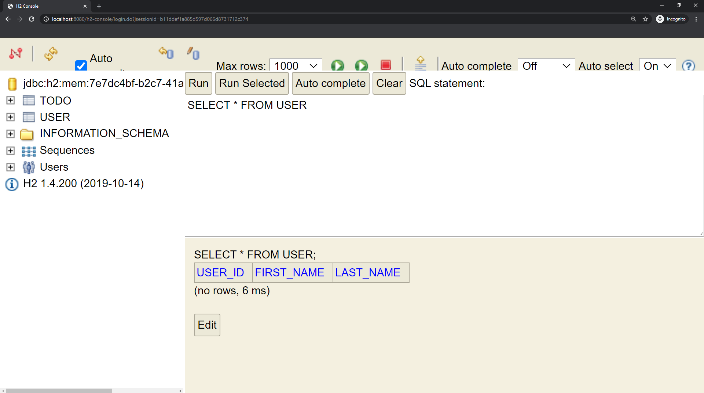

<Alert><ExtLink link="https://github.com/rajrajhans/spring-boot-todo">GitHub repository associated with this post</ExtLink></Alert>

Happy New Year, folks! If you follow my blog posts, you would notice that my preferred tech stack that I mostly use for projects is React, Python (Flask), and AWS / Heroku for deployment. I have also dabbled a bit in PHP-land with WordPress. Recently, I decided to try out an entirely new framework used to develop web applications called Spring Boot, which is based on Java.

However you choose to implement it, the basic **core concepts of the web remain the same**. "Frameworks" are nothing but tools to help us solve problems we face and make life easier for us developers. So, sometimes, it's good to step out of the comfort zone, and give something new a try to make sure that we aren't "stuck in our ways" and also to see how other tools are solving the same problems.

This post contains the notes I made while developing a basic application in Spring Boot. I had a background in creating web applications with Python Flask and JavaScript Frameworks. If you are in the same boat I was, this post will definitely help you figure out what Spring is, how things work in the Spring world, and how you can get started with it. Time to time, I have included references to things in Flask world, so you will have a solid conceptual understanding and will be able to see past the jargon. I have also included references at the end of the post, in case you want to dive deep, I recommend checking them out.

Let's start with understanding the basics of the Spring framework.

# What is the "Spring Framework"

- Spring is a application framework for developing applications Java .
- It provides structure and common patterns that makes the process of building web applications in Java much easier.
- Things like Spring Boot, Spring Data and Spring Batch are all built on top of Spring. Let's spend some time on some concepts behind the Spring Framework.

## What does the Spring Framework provide

Following are the three basic "things" that it provides. (There's more, but these three are the most basic ones)
1. Dependency Injection Container ("Application Context")
2. Data Access APIs
3. Spring MVC

Let's take a look at each of these one by one.

## 1. Dependency Injection Container

**Spring framework is essentially a "dependency injection container" at it's core**
Let's dissect and understand this statement.

- What is a dependency?
    - Simple. A "dependency" is something that your code depends on.
    - For example, if you have a method class `A` that is responsible for finding a product by it's name, you would need to access the database to do that. Let's say another Java class called `DataSource` is responsible for connecting to the database. So, `DataSource` is a dependency for class A.
    - Now what if you have another method/class that also wants to access the database to do something. One way to achieve that would be to create another instance of `DataSource` inside the new method. That would work, but it is not a good practice. What if a `DataSource` opens up a socket connection from our Java program to the database? Spawning a new DataSource for every method then would be very expensive. Wouldn't it be nice if we didn't have to worry about finding and managing the dependencies and somehow the dependencies are managed and provided to the class for us?
        - This is what's called as **Inversion of Control**. We give up control over managing the dependencies and let someone else handle that for us in an efficient way. So, instead of creating a `DataSource` inside the class ourselves, we just accept it as an argument to our constructor and use that for everything! Now, our class `A` doesn't know about the application class anymore, or how to construct DataSources. Basically, now class A says "if you want to use me, you need to give me a datasource as an argument."
        - That sounds cool, but we still have to manually construct and *inject* a `DataSource` when we use class A. Wouldn't it be nice if *someone* knew that our class A has a DataSource dependency, and then that *someone* would somehow construct both the objects for us! Well, that *someone* is called as a .... you guessed it right ... a "dependency injection container".
    - So, what the statement "Spring is essentially a dependency injection container at it's core" implies is that Spring Framework basically manages the classes we write and also handles the dependencies of these classes for us. Spring Framework's `ApplicationContext` is that *someone* who has *control* over all our classes and then can take care of all the dependencies of all our classes for us.

## 2. Data Access APIs

- The usual way to have your Java applications "speak" to a database is using JDBC. However, it's a common pet peeve about JDBC that there's a lot of pain points about implementing things in JDBC.
- So, Spring provides easy to use APIs for database connectivity, transaction management, querying, and more. It allows you to work with JDBC but hides away the pain points and makes the experience easier.

## 3. Spring MVC

- You can broadly categorize any "web application" running on your server into two types:
    1. Dynamic Web Page Applications - These are proper web applications with frontend that provide rich pre rendered html pages with dynamic content. (kind of like PHP-world)
    2. REST APIs - These just expose endpoints which can be consumed by front end webapps / SPAs (like React).
- Spring framework comes with a web framework called "Spring MVC". Spring MVC allows us to easily create web applications and REST APIs using the same Spring application model and dependency injection concepts.

## How are Spring Framework and Spring Boot related?

- Spring Boot builds on top of the Spring framework.
- Spring Boot provides opinionated out of the box default configurations which helps you set up applications quickly without wasting too much time in configurations. In case you want something different than Spring Boot provides, you can always override it. Spring Boot flavors **"convention" over "configuration"**
- So, think of Spring Boot as a "project initializer" for Spring projects.
---
# Developing a REST API using Spring Boot

Now that we have sufficient information about the Spring framework, let's set up all the things we would need to develop a simple REST API. What should we build? Well, whenever I am trying out any new framework, I begin by implementing a very simple ToDo app.

If you want the full code with many functionalities of a ToDo app implemented, visit this repo. In this post, we will just focus on setting up the barebone files and classes needed to get started with developing a simple REST API using Spring MVC and also understand the concepts behind them. Let's get started!

## Tools & Tech Used

Side Note: If reading this list makes you feel intimidated, don't be. Even I had no idea what most of these are and what they do. So, I have included details about each of them. At the end, I realized that I already knew the concepts behind these and the names is mostly Java terminologies.

- Spring Boot 2
- Spring Framework 6
- Spring Data JPA
- Hibernate
- H2 Database
- Spring MVC
- Apache Maven
- IDE: IntelliJ Ultimate

## Setting up a Spring project

We will use Spring Initializr to set up our project. Spring Initializr is a tool that  generates a Spring Boot project structure for us.

One of the core things behind Spring Initializr are the Spring Boot Starters. Spring Boot Starters are curated sets of dependencies that manage all the dependencies we need and wire them up for us. This enables us to avoid manually adding the dependencies in Maven. (Side Note: what is Maven? Maven is a build and dependency manager tool for Java, like we have npm in JS-world)

1. Go to `[start.spring.io](http://start.spring.io)` and enter project details and dependencies.
2. For me, the required dependencies were -
    1. Spring Web
    2. Spring Data JPA
    3. H2 In Memory Database



3.  Click on "Generate" once you enter the
     details and the dependencies

Here is a snapshot of my selections in start.spring.io

When you click on "Generate", it will download the preconfigured project as a zip file, which we can use.

The other way to use [start.spring.io](http://start.spring.io) is to select "Spring Initializr" directly in the "Create New Project" window in IntelliJ, which will then ask you to enter the same details.



The other way to use [start.spring.io](http://start.spring.io) is to select "Spring Initializr" directly in the "Create New Project" window in IntelliJ, which will then ask you to enter the same details.

## Setting up JPA Entities

### What does "JPA" mean in Java?

- Remember we have SQLAlchemy as the ORM in Django/Flask world? If not, I have discussed about it in this post - [https://rajrajhans.com/2019/03/introduction-to-peewee/](https://rajrajhans.com/2019/03/introduction-to-peewee/))
- JPA stands for Java Persistence API. It provides a *specification* for persisting, reading, and managing data from your Java object to relations in database. (basically *mapping* objects to relations).
- So, if JPA just provides the specification, wo implements it? There are various providers that implement it. Hibernate is one of the popular ones.
- Okay, then what is Spring Data JPA? It is another layer on top of JPA which Spring provides to make our life easy.

I hope all the jargon is clear now. Here, we will be using use Spring Data JPA along with Hibernate as our JPA provider. Let's get started by creating classes for entities that we need for our application.

### What does "Entity" mean in JPA?

Entities in JPA are nothing but POJOs representing data that can be persisted to the database. Each entity represents a table stored in a database. Every instance of an entity represents a row in the table.  (like we used to do in Flask with models.py) We'll keep it simple by having just two entity classes -

1. Todo: A class for storing a todo item.
2. User: A class for storing details about users, for example, who wrote that todo.

So, there'll be a many to one relationship between them, i.e. a todo will have one user as the author, and one user can have many todos. Pretty simple for starting.

For creating the POJOs, we will create a package `src/main/java/com.yourorg.yourapp/domain`. I have also linked the GitHub repo for this, so check that out as well if you get confused.

Question: How will Hibernate (our ORM) understand that this POJO we are creating is a entity? (In Flask, we extend a class from the ORM). Here, we will use Annotations ([https://dzone.com/articles/how-annotations-work-java](https://dzone.com/articles/how-annotations-work-java)) to tell ORM "Hey, this class is Entity, so do your thing". We will also be specifying the relationships between our entities in a similar way. Do read the code snippets below (along with the comments) to get a clear idea.

User Class:

```java
package com.rajrajhans.SpringTodoApp.domain;

import javax.persistence.*;
import java.util.Objects;
import java.util.Set;

@Entity                             // Telling Hibernate that this is a entity class
public class User {

    @Id                             // Telling Hibernate that "id" property is the primary key
    @GeneratedValue(strategy = GenerationType.AUTO)     // Telling Hibernate that "id" is gonna be auto generated by our database
    private long user_id;

    private String firstName;
    private String lastName;

    @OneToMany(mappedBy = "author")                     // mappedBy indicates that this side is the inverse
                                                        // side, and that the mapping is defined by the attribute
                                                        // author at the other side of the association
    private Set<Todo> todos;

    public User() {                 // Doing this because JPA requires a zero arg constructor
    }

    public User(String firstName, String lastName, Set<Todo> todos) {
        this.firstName = firstName;
        this.lastName = lastName;
        this.todos = todos;
    }

    public long getId() {
        return user_id;
    }

    public void setId(long id) {
        this.user_id = id;
    }

		// getters and setters for rest of the properties omitted for brevity

    @Override
    public boolean equals(Object o) {                               // implementing a custom equals method to make sure
    if (this == o) return true;                                     // that two objects of class "User" are compared based on their ids
        if (o == null || getClass() != o.getClass()) return false;  // so that Hibernate and Set will consider two objects with same id as equal
        User user = (User) o;
        return user_id == user.user_id;
    }

    @Override
    public int hashCode() {
        return Objects.hash(user_id);
    }
}
```

Todo Class:

```java
package com.rajrajhans.SpringTodoApp.domain;

import javax.persistence.*;
import java.util.Objects;
import java.util.Set;

@Entity
public class Todo {

    @Id                             // Telling Hibernate that "id" property is the primary key
    @GeneratedValue(strategy = GenerationType.AUTO)     // Telling Hibernate that "id" is gonna be auto generated by our database
    private long id;

    private String task;

    @ManyToOne
    @JoinColumn(name="user_id")
    private User author;

    public Todo() {                 // Doing this because JPA requires a zero arg constructor
    }

    public Todo(String task, User author) {
        this.task = task;
        this.author = author;
    }

		// getters and setters for the properties omitted for brevity

    @Override
    public boolean equals(Object o) {                               // implementing a custom equals method to make sure
    if (this == o) return true;                                     // that two objects of class "User" are compared based on their ids
        if (o == null || getClass() != o.getClass()) return false;  // so that Hibernate and Set will consider two objects with same id as equal
        Todo todo = (Todo) o;
        return id == todo.id;
    }

    @Override
    public int hashCode() {
        return Objects.hash(id);
    }
}
```

Great, at this point, our entity classes are ready. We have established the entity mapping, but that is not enough. We need to somehow tell JPA to do CRUD operations on the database for us. We want to tell it things like "Hey, add this todo as a row in the table", or "update this row with this new data", or "Hey, give me todos that this user has made".

To make all this things happen, we will now add "Repository" interfaces for both User and Todo which use the class provided to us by Spring Data JPA.

## Setting up Spring Data JPA Repositories

- Spring Data JPA is like another layer of abstraction over JPA which makes it easy for us do work with databases in Java.
- It takes care of all the ceremonial code like transactional commands, hibernate commands for us.
- Spring Data JPA is based on the Repository pattern. It is just an abstraction that allows to reduce the amount of boilerplate code required to work with databases. You can think of a repository as a mechanism for encapsulating storage, retrieval, and search behaviors.

### What is `CrudRepository` in Spring Data JPA?

- For any entity we have, there is a set of operations we need to do, like, create, read, update or delete.
- One approach is to write those CRUD methods for each of the entities ourselves.
- However, Spring Data JPA has a interface `CrudRepository` which provides generic CRUD operations on a repository of specif ic type.

Following is the code for UserRepository and ClassRepository interfaces. They are in `src/main/com.yourorg.yourapp/repositories` Here is the link for them in the GitHub repo.

Code for UserRepository:

```java
package com.rajrajhans.SpringTodoApp.repositories;

import com.rajrajhans.SpringTodoApp.domain.User;
import org.springframework.data.repository.CrudRepository;

public interface UserRepository extends CrudRepository<User, Long> {        // Since it is a generic, we are passing the type (User) and the ID type (which is long)
    // We are just providing the interface, Spring will provide us with the implementation

    // if we want some special operations which are not there in CrudRepository, then we can include it here
}
```

Similarly, for TodoRepository:

```java
package com.rajrajhans.SpringTodoApp.repositories;

import com.rajrajhans.SpringTodoApp.domain.Todo;
import org.springframework.data.repository.CrudRepository;

public interface TodoRepository extends CrudRepository<Todo, Long> {        // Since it is a generic, we are passing the type (Todo) and the ID type (which is long)
    // We are just providing the interface, Spring will provide us with the implementation

    // if we want some special operations which are not there in CrudRepository, then we can include it here
}
```

### Enabling the H2 Console

We are using a simple H2 in memory database at this point. It has a nice GUI (think like phpmyadmin for MySQL), but we need to enable it first. To do that, go to `src/main/resources/application.properties` and add this line:

`spring.h2.console.enabled=true`

Now, once you run the Spring project, you can get a nice GUI for our database at `localhost:8080/h2-console`. You can see the entities that we coded there, along with the options to run SQL queries against them. Pretty neat!



Here's a diagram which explains the Request Processing Workflow of Spring Web MVC


## Setting up Spring Controllers

- We need to associate a controller method with a request path, so, when Spring gets a request on a specific path, a specific controller method will get invoked, which will then access the database and do what what we want to do.
(like we have routes in Flask)
- To tell Spring that a class is actually a Controller, we use the `@Controller` annotation. This will register the class as a Spring Bean and as a Controller in Spring MVC.
    - Side Note: What is a Spring Bean? A Spring Bean is simply any object that is completely managed by the Spring IoC Container. (IoC = Inversion of Control)
- To map methods to http request paths, we use the annotation `@RequestMapping`

Following is the code for `TodoController` which we are mapping to /todos

```java
package com.rajrajhans.SpringTodoApp.controllers;

import com.rajrajhans.SpringTodoApp.repositories.TodoRepository;
import org.springframework.web.bind.annotation.RestController;
import org.springframework.ui.Model;
import org.springframework.web.bind.annotation.RequestMapping;

@RestController                                     // telling Spring that this is a Controller for a REST API
public class TodoController {

    private final TodoRepository todorepo;          // Adding a "dependency" on the TodoRepository

    public TodoController(TodoRepository todorepo) {// Now when Spring instantiates this controller,
																										// it will also inject a TodoRepository instance
        this.todorepo = todorepo;
    }

    @RequestMapping("/todos")               // mapping the route "/todos" to getTodos
    public String getTodos(Model model){    // The argument is basically a Model that we are going to
																						// return back to the view after adding our own things to it
        model.addAttribute("todos", todorepo.findAll());

        return "todos";
    }
}
// Note: this code is just to illustrate how to create a Controller
// To see the actual controller for the Todo REST API, see the linked github repo
```

At runtime, when Spring gets a request at `/todos`, it is going to execute the `getTodos` method and it's going to provide that method a Model object, and our code is going to add a attribute called "todos" to that model by executing a `findAll()` on todorepo (which will give us a list of todos). Then, this model will return back to our view layer, and it is going to have an attribute called `todos` on it, then we'll be able to utilize that value inside of our view layer to send a response back to the client.

## Setting up Services

- In Spring, business services are typically singletons. (so, they should be stateless and reusable)
- When the application starts, it creates an instance of the service, and maintains it in the memory.
    - Other controllers and classes can depend on the service, and Spring will inject it and make it available for them.
- Creating a Service is really simple. We just annotate the class with `@Service`

Here's the code:

```java
package com.rajrajhans.SpringTodoApp.services;
import org.springframework.stereotype.Service;

@Service
public class TodoService {
    // CRUD Methods for our resource here
  	// These CRUD methods will use the Repository we created in prior step!
}
```

We can then have this `TodoService` class as the dependency in our `TodoController` and then call service methods from there!

### What is the difference between a `@Controller` and a `@Service`?

- We use `@Service` annotation for classes that are in our service layer that perform some kind of "business service"
- On the other hand, we use `@Controller` for telling Spring that a particular class serves the role of a Controller, which means it's methods will handle the Request Mapping using the `@RequestMapping` annotation.
    - So, Spring MVC's `DispatchServlet` (think of this like the main controller that sits at the front of everything and takes in requests) class will dispatch all the incoming HTTP Requests towards appropriate Controller Classes. The Controller Class can then call Services to perform business logic and then send back the response.

## Wrapping Up

In this post, I covered many of the concepts I learned behind the Spring Framework, and how the jargon is actually the concepts you might already know but just in a different form. I also covered on how you can set up a Spring Boot Project for a simple REST API. I have implemented many more functionalities in the REST API, you can check that out in this repository.

# References

- ["What is Spring Framework? An unorthodox guide" - by Marco Behler](https://www.marcobehler.com/guides/spring-framework)
- [Understanding when to use JPA vs Hibernate](https://www.reddit.com/r/java/comments/16ovek/understanding_when_to_use_jpa_vs_hibernate/c7y57go?utm_source=share&utm_medium=web2x&context=3)
- [How Do Annotations Work in Java](https://dzone.com/articles/how-annotations-work-java)
- [Choosing between OneToMany & ManyToOne in Hibernate](https://stackoverflow.com/questions/16119531/hibernate-jpa-manytoone-vs-onetomany)
- [Learn to Build a Spring Boot Web App](https://www.youtube.com/watch?v=xaR7Nk0E1Aw)
- [Spring Boot Quick Start](https://www.youtube.com/playlist?list=PLqq-6Pq4lTTbx8p2oCgcAQGQyqN8XeA1x)
- [Spring MVC Framework Documentation](https://docs.spring.io/spring-framework/docs/3.2.x/spring-framework-reference/html/mvc.html)
- [Spring IoC Container Documentation](https://docs.spring.io/spring-framework/docs/3.2.x/spring-framework-reference/html/beans.html)
