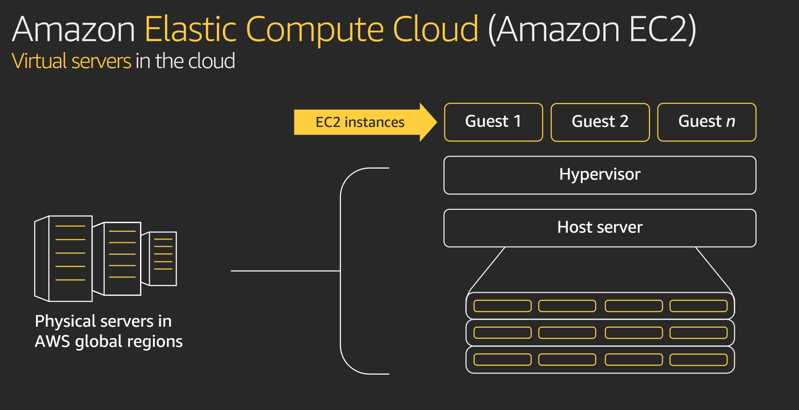
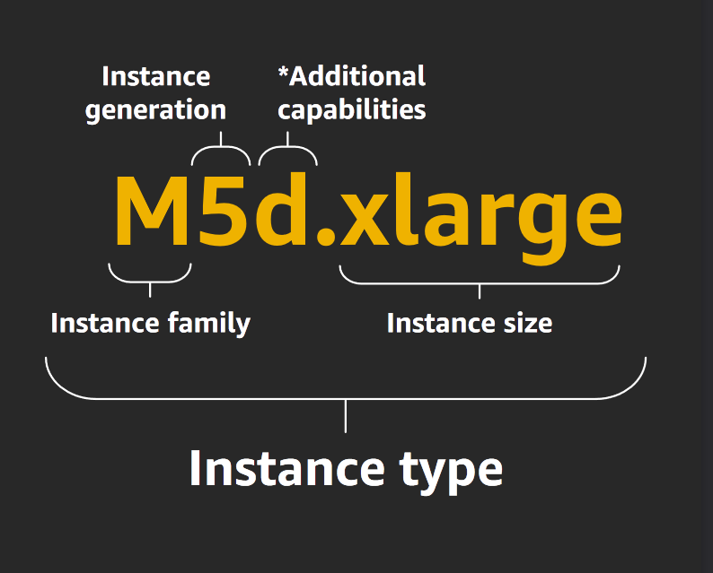
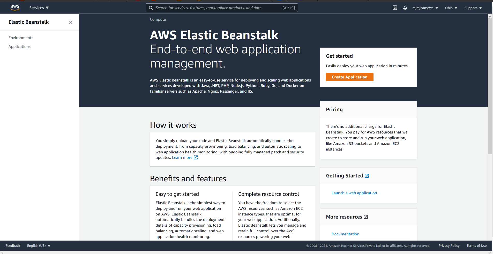
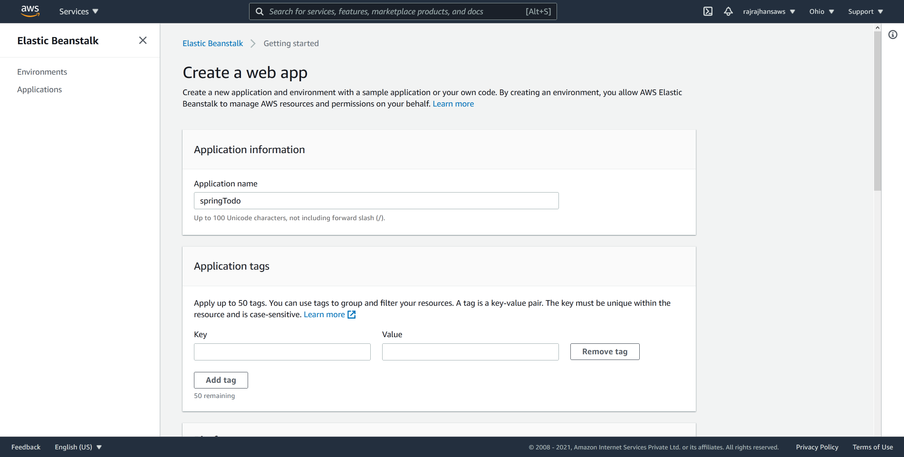
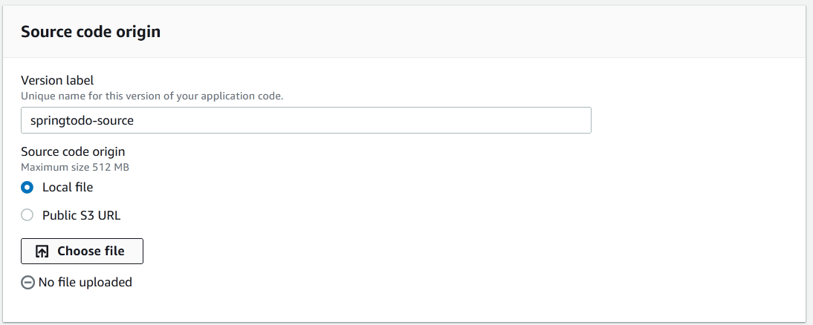
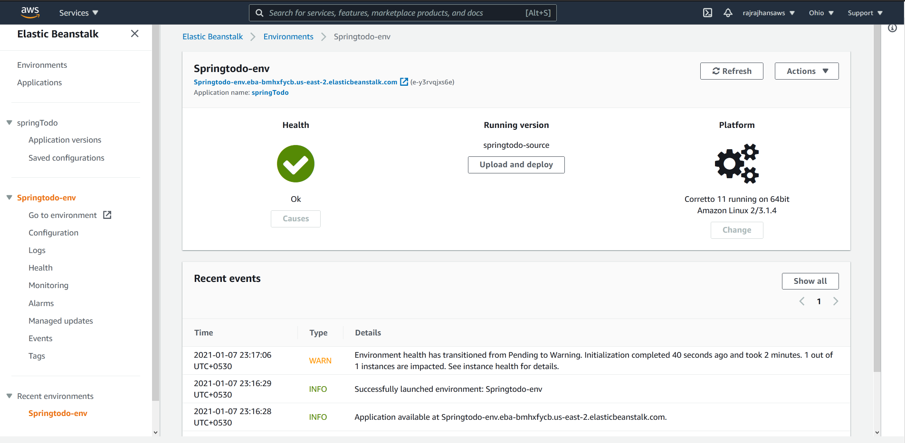
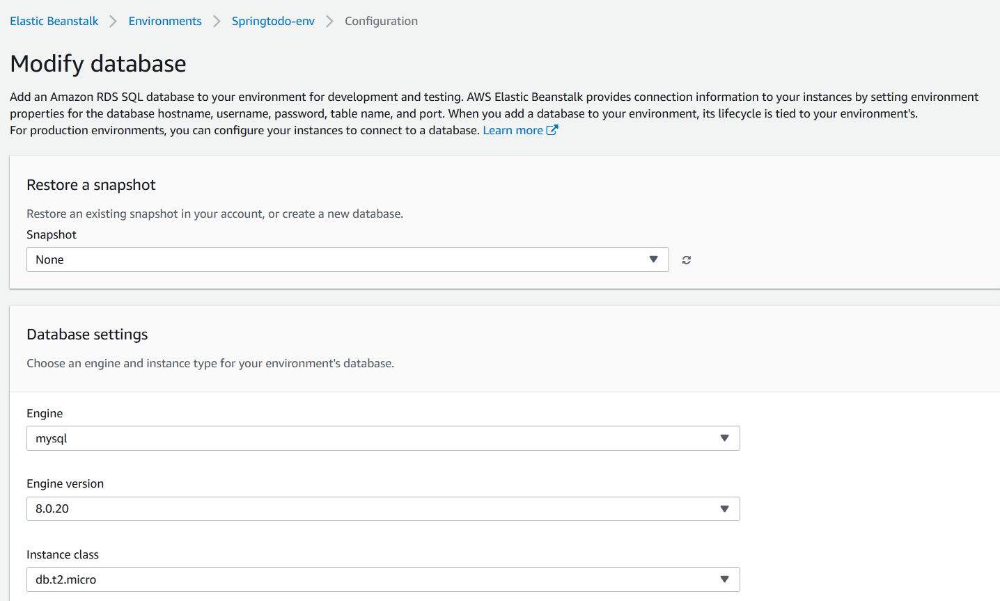

<Alert><ExtLink link="https://github.com/rajrajhans/spring-boot-todo">GitHub repository associated with this post</ExtLink></Alert>

In a previous post, I covered how to build a simple REST API using Spring Boot, and also covered basic concepts behind Spring Boot. In this post, let's take a look at how we can deploy an application developed using Spring Boot using AWS Elastic Beanstalk, AWS EC2, and AWS RDS (Relational database Service). I faced a lot of issues while deploying, and I have mentioned them in the steps at the end. I hope it saves you some time :)

Along the way, let's also understand how they work and what they do. If you want to dive a little deeper, I will highly recommend checking out the links in References.

## AWS EC2

- EC2 stands for Elastic Compute Cloud. It's a web service that makes it easy for us to provision Compute capacity in easy way. (Just like there's S3 for static storage, EC2 is for Compute)
- What is happening behind the scenes that makes it work? This informative slide from Mr Chetan Kapoor's reInvent talk answers this question:

<ImageWrapper>



</ImageWrapper>

- So, when we launch an EC2 instance, we are actually running our code on a virtualized portion of a server that is deployed in that AWS Region. The actual processors may be Intel's Xeon or AMD, or even Amazon's Gravitron processors.
- When I started looking into EC2, one thing I was confused about is the EC2 instance types. AWS documentation mentions many instances like `M5d.xlarge`. What does that mean? This image does a good job of explaining it -

<ImageWrapper width="450px">



</ImageWrapper>

- There are many instance types available with various compute-to-memory ratios. This link has info about them. You can choose one depending on your application specific I/O, storage, compute requirements. The app we are deploying is pretty simple, so I'm going to use the `t2.micro` instance type, for which AWS Free Tier provides 750 Hours per month without any charges.

## AWS RDS

- Amazon Relational Database Service (RDS) is what we will be using for provisioning our MySQL database on the cloud.
- RDS provides managed SQL database service and supports many other databases apart from MySQL.
- For the free tier, RDS provides 750 hours of `db.t2.micro` database usage, and 20 GB of storage.

## AWS Elastic Beanstalk

- Now you might be wondering, if we have EC2 for compute and RDS for database, then why do we need anything more?
- Think of Elastic Beanstalk like an orchestration engine. Instead of us having to manually configure instances, auto scaling, RDS, load balancing, beanstalk manages it all for us. It also provides really cool extra features like Versioning our deployments, Health Monitoring, etc.
- This is good since we do not have any special requirement and can get started quickly using Elastic Beanstalk.
- Let's take a look at the meaning behind some terminologies that EB uses:
    - **Application**: It's a "container" that encapsulates project code, infrastructure, etc.
    - **Application Version**: It's the project code that we deploy.
    - **Platform**: The language runtimes to run the application
    - **Environment**: Group of AWS infrastructure elements to support running the application

## Let's deploy our Spring Boot Application

- First, we will have to build Spring Boot application to create a `.jar` executable. Before doing that, make sure that your `[application.properties](http://application.properties)` file picks up spring datasource URL, username, and password from the environment variables. At runtime, our Beanstalk environment will provide details regarding the database through it's env vars. Following is my `application.properties` file. It sees if the env var is available, if not (in local environment), it will use the hardcoded values after the colon.
Note that the `RDS_` prefix is important since that's how Beanstalk provides us values from RDS. Without it, you will see JDBC connection errors!

```
spring.datasource.url=jdbc:mysql://${RDS_HOSTNAME:localhost}:${RDS_PORT:3306}/${RDS_DB_NAME:springtodo}
spring.datasource.username=${RDS_USERNAME:root}
spring.datasource.password=${RDS_PASSWORD:}
```

- You can now create a `.jar` file for the project using the following command -

```bash
mvn clean package spring-boot:repackage
```

- Upon completion, it will create a `.jar` artifact for our project in the `/target` directory.
- Now, let's create a Elastic Beanstalk environment. Go to the [Elastic Beanstalk Console](https://aws.amazon.com/elasticbeanstalk/) and click on "Create Application" once logged in.

<ImageWrapper>



</ImageWrapper>

Next, enter the information regarding your web application and select the appropriate Java version.

<ImageWrapper>



</ImageWrapper>

At the bottom, you will see an option for "Source code origin". You can upload the compiler .jar file we created here.

<ImageWrapper>



</ImageWrapper>

At the bottom, you will see an option for "Source code origin". You can upload the compiler .jar file we created here.

<ImageWrapper>



</ImageWrapper>

Our environment is created and the app is live! But wait, we are not done yet. We are yet to provision a MySQL database that our app needs. Without it, there'll be JDBC connection errors all over the place!

For setting up a MySQL database using RDS, following are the steps

- Go to Environments > Configuration in Elastic Beanstalk console
- Scroll down to "Database" and click on "Edit". Enter the details regarding the database here.

<ImageWrapper>



</ImageWrapper>

- Once submitted, AWS will take a few minutes to create an RDS MySQL instance and update our Beanstalk environment with the new MySQL database environment vars. Make sure that the you are taking database username and password from the environment in your `[application.properties](http://application.properties)` file.
- As a last step, you will need to modify security groups in your RDS instance and EC2 instance to make sure that the database instance can be contacted by the code. [Here](https://stackoverflow.com/questions/46311096/unable-to-establish-connection-to-jdbcmysql-communication-link-failure) are the instructions to do the same. Make sure following things are true for your EC2 and RDS instances.
    - The EC2 instance and the RDS instance have a security group in common
    - The Security Group has valid Inbound and Outbound Rules for TCP connections.

And, that is it! At this point, your Spring Boot application would be deployed without any issue! Note that by default, since we're using Tomcat, it would be deployed on port 8080.

<ImageWrapper>


</ImageWrapper>

**Note:** Remember to terminate your environment in Elastic Beanstalk to avoid wastage of your free tier credits. (As a side note: Always make sure to set up CloudWatch Billing alerts to ensure that you don't get charged in case your free tier limits are crossed without you knowing!)

That's it for this post, I hope it was helpful!

## References & Credits

- [Amazon EC2 Foundations: A talk by Chetan Kapoor](https://www.youtube.com/watch?v=kMMybKqC2Y0)
- [A talk on Elastic Beanstalk by Prashant Prahlad](https://www.youtube.com/watch?v=o4clRJuH9xU&t=872s)
