<Alert><ExtLink link="https://github.com/rajrajhans/mlh-show-and-tell-aws-rekognition">GitHub repository for the demo app</ExtLink></Alert>

As part of the MLH Fellowship, I gave a Show & Tell talk on the topic "Leveraging AWS Rekognition to build ML Powered WebApps". The aim of the talk was to get the audience familiar with AWS Rekognition and other related AWS services they need to can add machine learning and computer vision abilities and better tackle real world problems through projects.

# What are we building?
As a demo, I built a simple WebApp that takes in image input from the user, performs and displays results of operations like Object Detection (identifying known objects from the image), PPE Detection (checking for face, hand cover), Facial Analysis (Face Detection, Prediction of facial attributes like age, emotion, eyewear, smile, etc). This post contains all the details you need to know for the same. For the code, refer to [this repo](https://github.com/rajrajhans/mlh-show-and-tell-aws-rekognition).

## Why is this helpful?
We can extrapolate this and develop projects that solve real world problems. Examples:
- Virtual Proctoring
- PPE Detection
- Image search engine
- Facial Authentication
- Retail store analytics
.... the possibilities are endless

# Technologies we are going to use

For the frontend part, we shall use ReactJS, and we'll also use a bit of HTLML Canvas API to display cropped images based on Bounding Boxes that Rekognition returns to us.

## AWS Lambda

Lambda is a compute service that we can use to run our code in the cloud without worrying about provisioning and managing servers, which is why it is also referred to as "serverless compute service". The code is deployed as functions aligned which are aligned to an event source. An "event source" can be things like network requests to endpoints, or changes in data or resource states. You can also use other AWS services are event source. For example, you can configure AWS Cognito as event source which will trigger a Lambda Function whenever a "signup" event occurs. Another example would be configuring AWS S3 as event source which will trigger a Lambda every time an image file is uploaded, the lambda function can then do things like compress/resize the image. Lambda supports many runtimes, as shown in the below image:

<ImageWrapper>

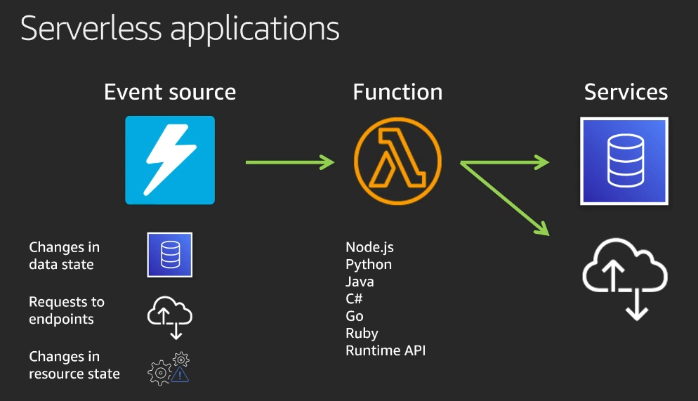

</ImageWrapper>

We will be using the NodeJS runtime. So, we will write our code in JavaScript. This code will use the AWS SDK to interact with the Rekognition service.

## Lambda function handler in NodeJS

The Lambda function handler is the method in your function code that processes events. When your function is invoked, Lambda runs the handler method. The runtime passes three arguments to the handler method

1. `event` : an object that contains information from the invoker. The "invoker" passes this as a JSON formatted string. The runtime then converts it to an object and passes it to our handler.
2. `context` : an object that contains information about the invocation, function and execution envitonment.
3. `callback` : A function which we can call in non async handlers to send a response. The callback function takes two arguments: an error and a response and the arguments should be compatible with JSON.stringify.
    - When you call the callback, Lambda waits for the event loop to be empty and then returns the response or error to the invoker.
    - For async handlers, we return a response, error or a promise to the runtime instead of using callback. When we resolve or reject the promise, Lambda sends the response or error to the invoker.

## Lambda Function Lifecycle

<ImageWrapper>

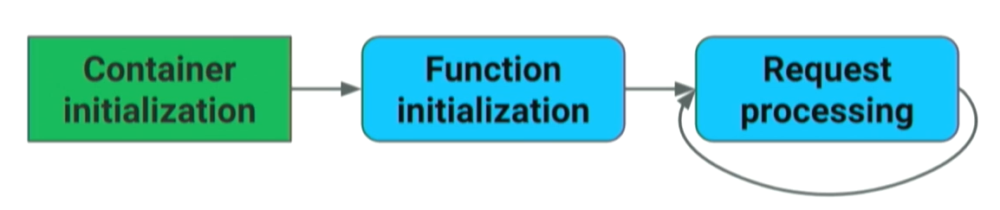

</ImageWrapper>

When a Lambda function is first invoked, it creates (or unfreezes) an execution environment with the configured resources, downloads the code for the function, initializes any extensions, initializes the runtime, and then runs the function’s initialization code. After this is done, Lambda invokes the function handler (that we have written). After the function runs to completion, Lambda prepares to handle another function invocation. If the Lambda function does not receive any invocations for a period of time, it begins the Shutdown phase. In this phase, Lambda terminates the runtime, alerts the extensions to let them stop cleanly, and then removes the environment.

## AWS API Gateway
We have seen that Lambda functions are event driven. For our purposes, you can think of API Gateway as one way to invoke our Lambda functions from the outside world. API Gateway will provide us a URL endpoint, and then we can further "map" endpoints and HTTP methods (GET/POST/PUT/DELETE) to specific lambda functions. For example, we can specify that if, say a POST request hits /signup, then handleSignUp lambda function should be invoked and all the network request details (body, headers) should be proxied to that lambda function.

<ImageWrapper>

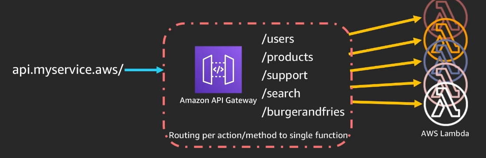

</ImageWrapper>

So, API Gateway is a fully managed service for creating, publishing, maintaining, monitoring, and securing REST, HTTP or WebSocket APIs.

This is all you need to know to build a demo WebApp. You can go through the code here. I have added comments wherever necessary. Check out the [Rekognition Documentation](https://docs.aws.amazon.com/rekognition/latest/dg/API_Reference.html) for details about how we have used AWS SDK in the code. I'll include the screenshots of the demo app here:

# Screenshots

<ImageWrapper>

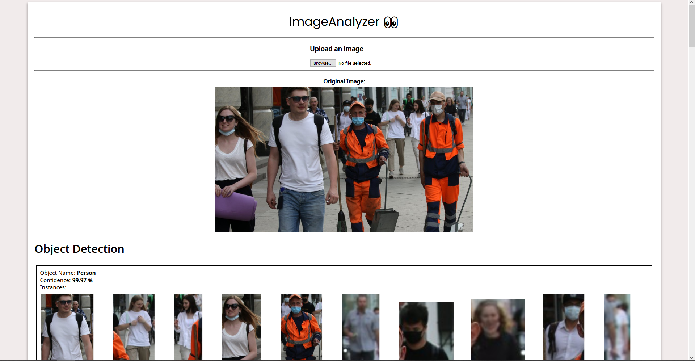

</ImageWrapper>

<ImageWrapper>

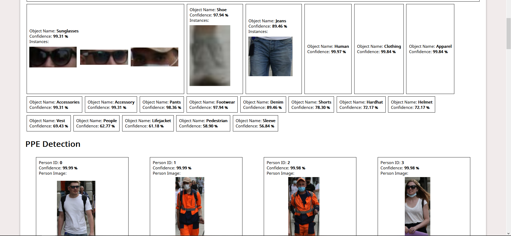

</ImageWrapper>

<ImageWrapper>

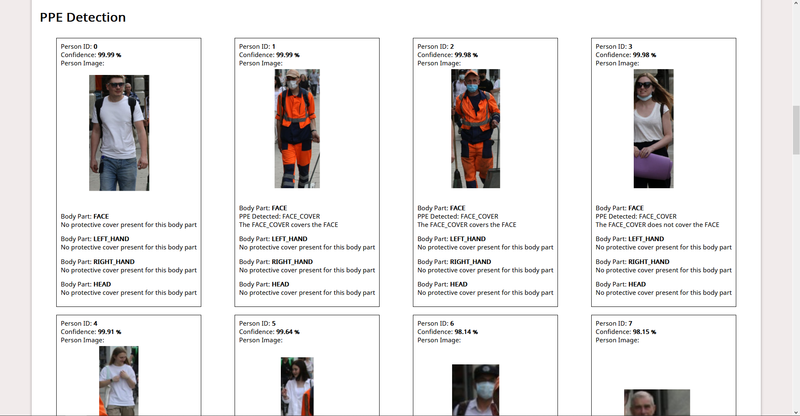

</ImageWrapper>

<ImageWrapper>

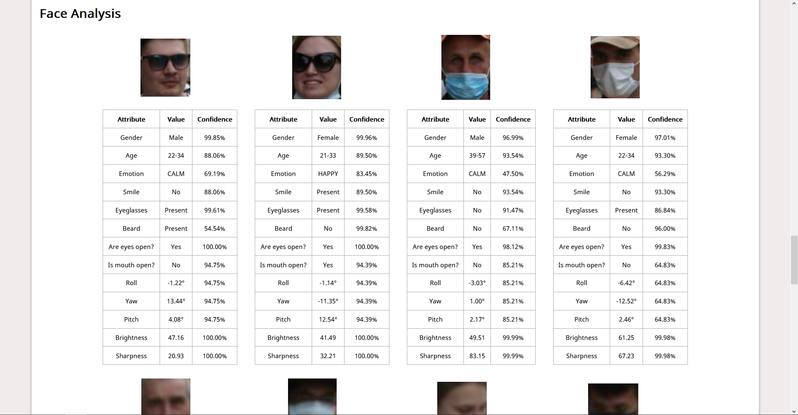

</ImageWrapper>

<ImageWrapper>

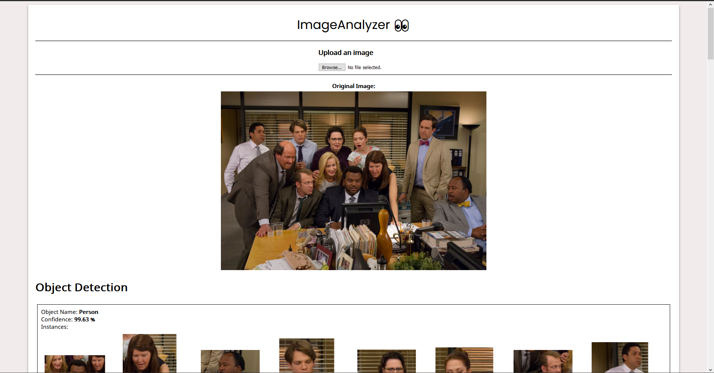

</ImageWrapper>

<ImageWrapper>

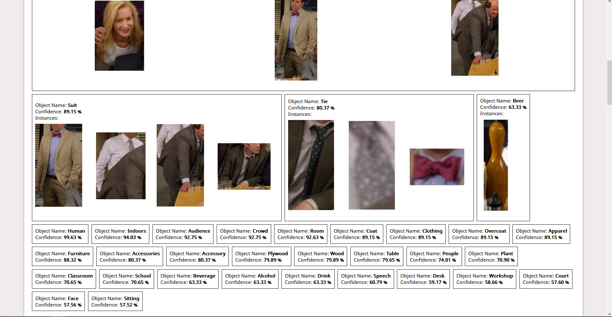

</ImageWrapper>

<ImageWrapper>

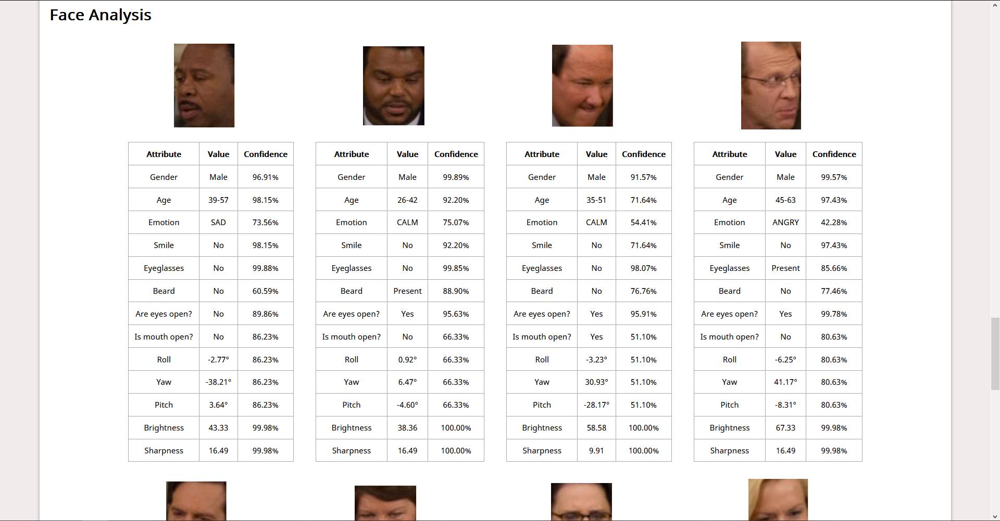

</ImageWrapper>

<ImageWrapper>

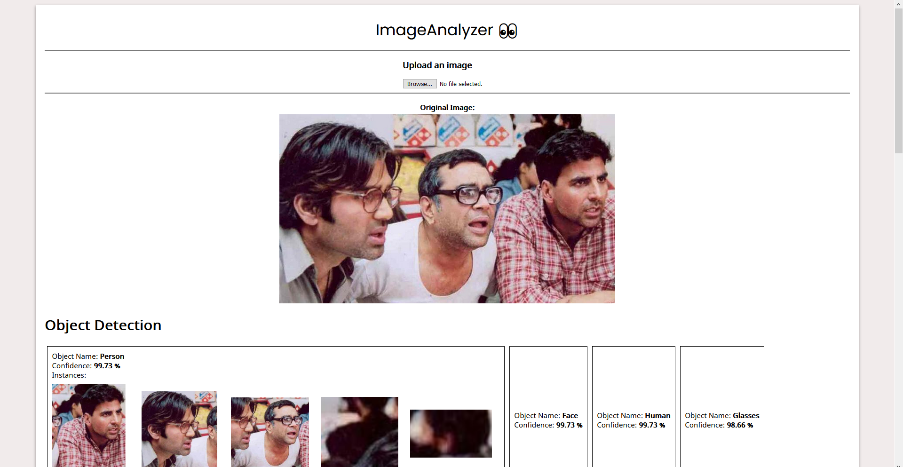

</ImageWrapper>

<ImageWrapper>

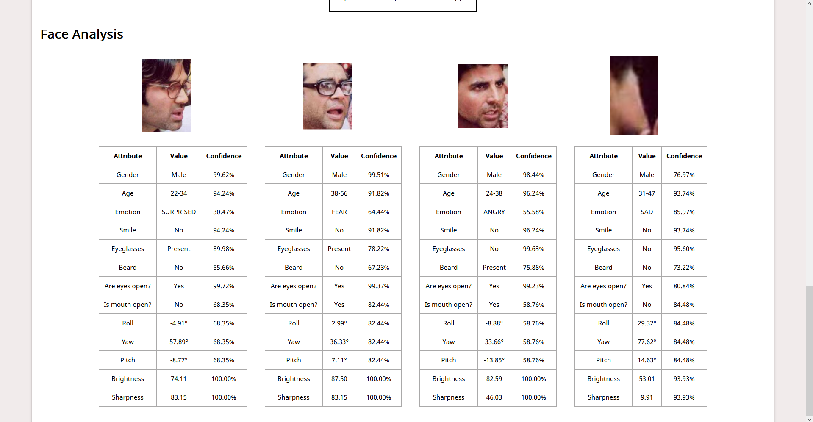

</ImageWrapper>

