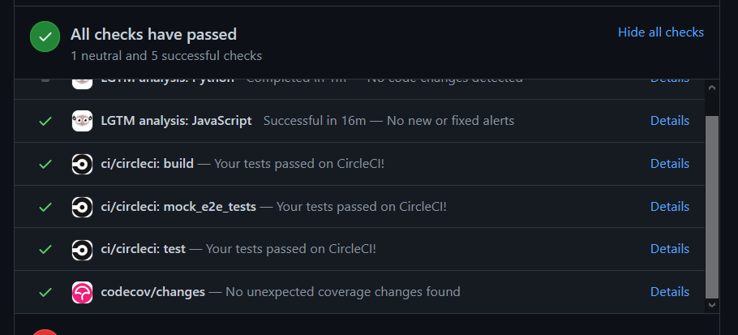

import image2 from "./git-rebase-v-merge-2.png"
import image3 from "./git-rebase-v-merge-3.png"
import image4 from "./git-rebase-v-merge-4.png"
import image5 from "./git-rebase-v-merge-5.png"
import image6 from "./git-rebase-v-merge-6.png"
import image7 from "./git-rebase-v-merge-7.png"

Some of the concepts in git are such that, however much you read about it, you won't fully grasp their mental models unless you actually are in a situation where you have to use them. I was recently in such a situation where I did a merge instead of a rebase. Then I read about the differences between the two and where each should be used. This post is a description of the situation and notes on what I learned from it.

# The Situation

As part of the MLH Fellowship, I'm currently working as an Open Source Fellow with the Amplify CLI team. The task I was working on was adding unit tests to the `amplify-provider-awscloudformation` package in the [aws-amplify/cli](https://github.com/aws-amplify/amplify-cli/) repo.

A few things you need to know before we go in →

1. **Amplify CLI repo CI CD Pipeline**

Amplify CLI repo has a CI CD pipeline which uses CircleCI. Whenever one makes a PR, Circle CI runs all tests and makes sure that they pass. If they fail, it notifies on the PR.

<ImageWrapper>



</ImageWrapper>

2. **Background context on how I ended up needing to do a rebase or merge**

My task was to add new unit tests. When I checked out a new branch to work on, there was an issue in the master branch which caused the tests to fail on the CI. So, when I checked out a new branch, that code came in my new branch as well, and I was working on a adding unit tests, so it was essential that all tests pass for my PR. But, there was an existing issue from master which caused tests to fail.

Then, I looked into what was causing the tests to fail on master, and with some help, was able to fix it. I created a new [PR which would fix the failing tests on master](https://github.com/aws-amplify/amplify-cli/pull/7053). After a review, it was merged. Cool.

Now, back to our original PR of adding new tests. The fix for failing tests was merged to master, but that fix isn't there in my branch (which I checked out before the fix was merged), so my tests still failed!

So, now at this point, I will have to **update that branch with changes from master**. Turns out, there are two ways to integrate changes from one branch to another in Git.

## The Merge Way

When you do `git merge`, there are two possibilities based on how your history is. Let's see both of them.

### Fast forward merge

- Lets say you are on master with latest commit C2, and you want to make some changes. You create a branch named `hotfix`
- Then, you do your work on the `hotfix` branch, make a new commit C4, and now you merge it to master, so you checkout `master` and merge the `hotfix` branch

<ImageWrapper isTransparent="true">


</ImageWrapper>

- In case like this, where there haven't been any additional changes to master, git will show you this message saying that "it has fast forwarded"

    ```
    $ git checkout master
    $ git merge hotfix
    Updating f42c576..3a0874c
    Fast-forward
     index.html | 2 ++
     1 file changed, 2 insertions(+)
    ```

- This happens when there is a clear path from the tip of the master branch to the tip of the feature branch, i.e. when there are no commits on the master branch that occurred after the feature branch was created
- If this is the case, git will just move the master pointer forward because there is no "divergent" work to merge together - this is called as a "fast forward"

<ImageWrapper isTransparent="true">


</ImageWrapper>

- So it won't create a merge commit in case of a fast forward.
- Note that this happens only in specific scenarios where its possible to do so. In most scenarios, what happens is known as a "Three way merge"

### Three way merge

<ImageWrapper isTransparent="true">


</ImageWrapper>

- Let's say you are in the `experiment` branch, the master branch has some additional commits (C3) which you want to have in your `experiment` branch. Now git cannot do fast forward because in this case, the history is divergent.
- When you do `git merge experiment` while on `master` branch, git will first see what the common ancestor for both these branches is. In our case, it is C2
- Then, it will take the latest changes from both these branches, which, in our case, is C3 and C4
- Once it knows about C2, C3, and C4, it will then create a **new commit "**C5" (called as the "merge commit")  which will have changes from all three commits, therefore its called as a "three way merge"

<ImageWrapper isTransparent="true">


</ImageWrapper>

- So, to summarise, git will perform a three way merge between the two latest branch snapshots (C3 and C4) and the most recent common ancestor of the two (C2), and create a new "merge commit" (C5) which has changes from both of these branches.

## The Rebase Way

Our takeaway from the understanding the merge command was that a new merge commit is created, and the old commits from both parallel branches are retained in the history.

Now, let's see how rebase approaches integrating these two branches.

### git rebase

<ImageWrapper isTransparent="true">


</ImageWrapper>

- Taking the same example, let's say you are in the `experiment` branch, the master branch has some additional commits (C3) which you want to have in your `experiment` branch
- When you do `git rebase master` while you are in the experiment branch, the first thing git does is that it checks both branches and has a look at the last commit both of them have in common. In this case, it is C2
- Then, git takes a look at the current branch (which is the `experiment` branch), and sees what actually changed in that branch. Then, it just "remembers" these commits. In this case, it is the commit C4
- Then, git goes back to the master branch, and sees what commits happened to the master after the last common commit. In this case, the new thing in master is commit C3.
- Now, git takes these commits from master, and then puts the commits for feature branch on top of these commits from master.

<ImageWrapper isTransparent="true">


</ImageWrapper>

- So now, the feature branch is no longer "based" on the the old master (C2), but now is based on the new master (with C3 included).
- To summarise, doing `git rebase master` while on `mybranch` will take all the new changes that were committed in `master` and will "reapply" it on `mybranch`, so that `mybranch` will now be based on the latest version of `master`

## When to use which

A rather simple rule of thumb would be "**merge to master branch, and rebase the feature branches"**.

### What is the difference, exactly?

You might have noticed that the snapshot pointed to by the final commit you end up with, whether it's by using rebase or by using merge is the same. The difference is in the history.

Rebasing replays changes from one line of work onto another in the order they were introduced, whereas merging takes the endpoints and merges them together.

You will choose between rebase and merge depending on your preference for wanting history. If you want a clean linear history which can show how you went from point A to B, you'll use rebase to keep the history clean. But, if you want to preserve the record of what actually happened, you'll want to go for merge.

### Rebase leads to more cleaner history

If you examine the log of a rebased branch, it looks like a linear history. It appears that all the work happened in series, one after another, even when it originally happened in parallel.

Because of this advantage, you will generally use rebase to update your branch with the master branch while contributing to public open source repositories, so that there won't be any unnecessary extra merge commit.

### Do not rebase commits that exist outside your repository and that people may have based work on

Git documentation [mentions](https://git-scm.com/book/en/v2/Git-Branching-Rebasing#_rebase_peril) that if you don't follow this rule, "people will hate you, and you’ll be scorned by friends and family", haha.

The reason for this is that when you rebase stuff, you are actually abandoning existing commits and creating new ones that are similar, but different.

If you push commits somewhere, and others pull them down, and base work on them, and then you rewrite those commits with git rebase and push them up again, those people will have to re merge their work. So, you have to be careful to not rebase commits that are other people may have based work on.

That's it for this post, thanks for reading. I hope it was helpful. See you in the next one :)

# References

- [Official Git Documentation: Rebasing Git Branches](https://git-scm.com/book/en/v2/Git-Branching-Rebasing)
- [Official Git Documentation: Basic branching and merging](https://git-scm.com/book/en/v2/Git-Branching-Basic-Branching-and-Merging)