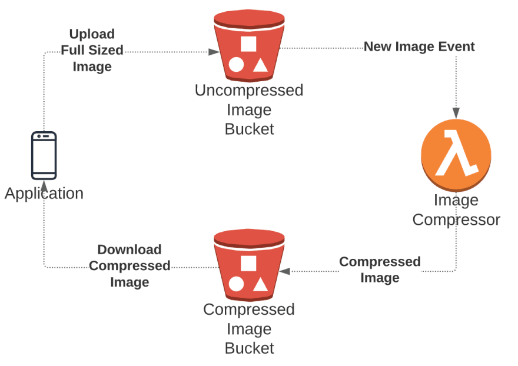
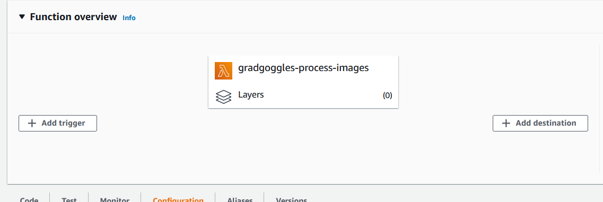
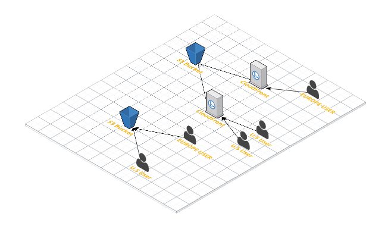

Last year, I worked on an interesting project which was a virtual yearbook and scrapbook for the graduating batch of 2020 in my college. You can read the case study for the project here. We recieved a very good response from users regarding GradGoggles.

Since the pandemic hasn't receded, even the batch of 2021 is going to graduate virtually. So, we're planning to work some more on GradGoggles and reach even more users this time.

# The Problem

When a user registers on the platform, they upload an image as their profile picture, which is then used on their profile, as well as on others' profile if they post a scrap for other users.

One mistake I made and realized a bit late after we got many users, is that I was directly storing the user uploaded profile pictures and then showing them as-is throughout the application. If some user uploads a high quality 5 MB picture, the whole application would potentially slow down because of that. Also, if some user uploads a picture in wrong dimensions, it would ruin the UI for other users. It's not just the performance, but the cost skyrockets as well, since that large image gets downloaded by so many other users multiple times.

Ideally, what should happen is that once user uploads the picture, it should be resized, compressed and then used. Taking this one step ahead, let's make two copies of the picture in different sizes - one relatively high res (for profile picture, yearbook picture, etc) and another a bit low res (for displaying on scraps where small size picture is needed) to improve performance.

I was using AWS S3 for storing the pictures, and the pictures were being uploaded to S3 from the client side itself, and the API would just receive the URL for uploaded image. So, doing the conversion on API side was not an option. (If you want to read about how images are being uploaded directly to S3 from client, [I've written about it here](https://rajrajhans.com/2020/06/2-ways-to-upload-files-to-s3-in-flask/))

So, this post describes a way to tackle this problem in an efficient way using AWS services. I've mostly focused on the Lambda code and the concept of the pipeline, so I'm assuming the reader is familiar with common workflows in the AWS ecosystem.

# The Solution

We'll create a simple image optimization pipeline which will get triggered whenever a new image is added to our S3 bucket. Then, using a Lambda function with NodeJS runtime, we'll write code which will use the `[sharp` library](https://www.npmjs.com/package/sharp) to resize the image into two sizes - one 200px wide, and another 800px wide, and finally, store it in another S3 bucket.

<ImageWrapper isTransparent="1">



</ImageWrapper>

# Why have another S3 bucket for resized images?

The way Lambda triggers work is that S3 sends an event to a Lambda function when an object is created, and then our Lambda function will create and store more images. So if you store the compressed images in the same bucket, and don't configure the trigger properly, then you might cause the Lambda function to be triggered recursively, i.e. lambda will get triggered and start executing by the image that it itself has created over and over again. This may skyrocket your costs to an insane level, so its safer to have two separate buckets.

# The code that will execute on Lambda

First step is to write the code that will be executed whenever an image is uploaded on our S3 bucket. As mentioned before, we'll be using `sharp` package for that. Refer the [Sharp installation docs](https://sharp.pixelplumbing.com/install#aws-lambda) to install the lambda specific package.

Here's the code for the Lambda function handler:

```js
const AWS = require("aws-sdk");
const S3 = new AWS.S3();
const sharp = require("sharp");

exports.handler = async (event) => {
  const { key } = event.Records[0].s3.object;

  // download the user uploaded image from S3 using object key
  const originalImage = await S3.getObject({
    Bucket: process.env.UNCOMPRESSED_BUCKET,
    Key: key,
  }).promise();

  // Compress the image to 200x200
  const compressedImage200Promise = sharp(originalImage.Body)
    .toFormat('jpeg')
    .jpeg({
        force: true,
    })
    .resize({
      width: 200,
      withoutEnlargement: true,
    })
    .toBuffer();

  // Compress the image to 800x800
  const compressedImage800Promise = sharp(originalImage.Body)
    .toFormat('jpeg')
    .jpeg({
        force: true,
    })
    .resize({
      width: 800,
      withoutEnlargement: true,
    })
    .toBuffer();

  const [compressedImage200, compressedImage800] = await Promise.all([
    compressedImage200Promise,
    compressedImage800Promise,
  ]);

  // Upload the compressed images appropriate folders in the Compressed Images bucket
  const firstS3Upload = S3.putObject({
    Bucket: process.env.COMPRESSED_BUCKET,
    Key: "200/" + key,
    Body: compressedImage200,
    ContentType: "image",
  }).promise();

  const secondS3Upload = S3.putObject({
    Bucket: process.env.COMPRESSED_BUCKET,
    Key: "800/" + key,
    Body: compressedImage800,
    ContentType: "image",
  }).promise();

  // wait for the operations to complete
  await Promise.all([firstS3Upload, secondS3Upload]);

  console.log(`Compressing ${key} complete!`);
};
```

The code is pretty self explanatory. Here's the GitHub link for your reference.

After this, you can deploy the Lambda function through AWS CLI, AWS Console, or any IDE Toolkits. Refer to the relevant documentation for deploying the Lambda function. Be sure to include your S3 bucket names as environment variables with `COMPRESSED_BUCKET` and `UNCOMPRESSED_BUCKET` keys.

Once that's done, you can add S3 Triggers to the Lambda function in the AWS Console through Lambda Dashboard. Click on "Add Trigger" and select "S3".

<ImageWrapper isTransparent="1">



</ImageWrapper>

Just select the correct S3 bucket, submit, and you're done!

You can test out the pipeline by uploading a sample image to the S3 bucket, and you should see the appropriate images in 200px and 800px width pop up in another S3 Bucket!

# Bonus Tip

If you are using S3 to store and display user uploaded images, make sure that you are distributing them using AWS CloudFront, which is a CDN. This way, you'll get better performance and lesser costs. Why? Because CloudFront caches your static assets so that and serves them to your users from edge locations rather than from the S3 Bucket. Take a look at this illustration

<ImageWrapper isTransparent="1">



</ImageWrapper>

To know more on how to do this, [visit here](https://aws.amazon.com/blogs/networking-and-content-delivery/amazon-s3-amazon-cloudfront-a-match-made-in-the-cloud/).

That's it for this post, I hope it was helpful. See you next time!


# References

- [AWS Blog on Resizing Images](    https://aws.amazon.com/blogs/compute/resize-images-on-the-fly-with-amazon-s3-aws-lambda-and-amazon-api-gateway/)
- [AWS S3 Lambda Triggers Documentation](https://docs.aws.amazon.com/lambda/latest/dg/with-s3.html)