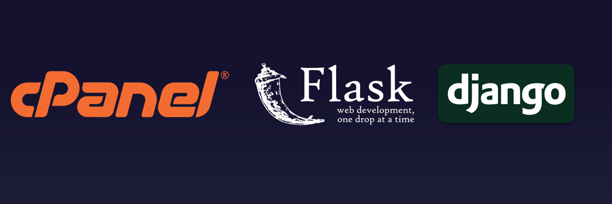
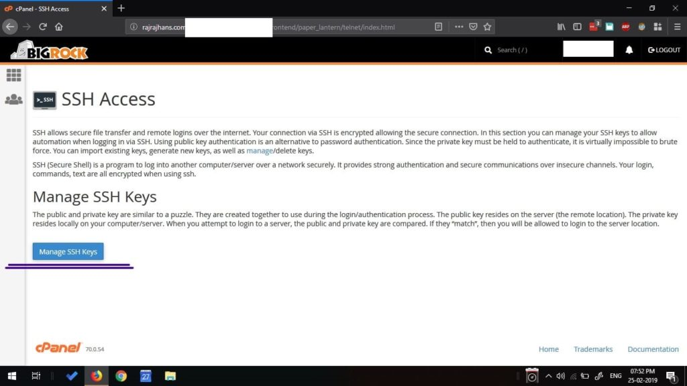

Hello! Today we will explore a bit about how to use python in the context of developing website or a WebApp. Now first thing to do when planning to develop a website is to buy a domain and hosting service. There are many types of hosting services like Dedicated Server Hosting, VPS (Virtual Private Server) Hosting, etc. But Shared Linux Hosting is the most affordable and is perfect for entry-level developers. Developing websites using PHP, JS on a Shared Hosting with cPanel provided setup is pretty straight-forward, but how can we run a Python based venv, i.e. a virtual environment on a cPanel based Linux hosting? We’ll need that for using a Python-based web framework. That’s what we’ll look into today.

# Why do I need a Web Framework and What is it anyway?

When you start developing programs in python, you do so in a command- line interface, i.e. the user has to enter input through the command line and then the output is displayed. That is the most basic form of a python program. Then comes GUI development, using Tkinter or PyQT.  Similarly, we can develop web applications where users will interact with your program through a web browser on their phones or PCs. Now a days, web apps are preferred over traditional desktop-based applications. They are convenient both for the user and the developer. Almost everyone today has internet access, so reach is not a problem. Users tend to be cautious with what apps they install on their phone or PC. With a WebApp, the user does not need to install anything. Also, webapps are easier to support for the developer and that means no downloading updates every month or so for the user. To sum up, a developer, or a user, would prefer a WebApp over a traditional Desktop app any day.

If you finally decide you want to develop a web application, and you want to develop it in Python, you’ll probably need a “web framework”. There are many repetitive parts of web application development that you would have to do every time if you wanted to develop the app from scratch. So, instead of reinventing the wheel every time, these “web frameworks” do it for you and let you focus on the important parts specific to your application. A web framework aims to implement all the functionality common to most web applications, such as mapping URLs to chunks of Python code.

There are two popular web frameworks in Python – Django and Flask. The differences between them and which one you should choose merits a separate post, but I’ll try to explain the differences in short here. In any framework, there are some things that are done by the framework itself and some things are left for the developer. Exactly what is left for the developer and what is taken care of by the framework varies from framework to framework. But these are the major differences between Django and Flask –

- Flask implements a bare-minimum and leaves the bells and whistles to add-ons or to the developer.
- Django follows a “batteries included” philosophy and gives you a lot more out of the box.

For more in-depth differences between these two, I highly recommend going through this article by <ExtLink title={"Flask vs Django"} link={"https://www.codementor.io/garethdwyer/flask-vs-django-why-flask-might-be-better-4xs7mdf8v"}> Gareth Dwyer – Flask vs. Django: Why Flask Might Be Better</ExtLink>

Now, to start using Python on your shared hosting, you’ll first have to check if python has been installed on the server. To do so, you’ll need SSH access to the server. In simple words, SSH (Secure Shell) allows you to connect to your server securely and perform operations in a Linux command line interface. The settings regarding SSH are available in your cPanel.

After <ExtLink title={"PuTTY"} link={"https://www.chiark.greenend.org.uk/~sgtatham/putty/latest.html"}> downloading PuTTY</ExtLink>, enter your hostname and keep the port default, i.e. 22, which is a TCP/UDP port. Then, a shell will open asking for username. Enter your cpanel username there. And then the password for accessing cpanel. After that, voila! A shell to your web server will open! To check if python is installed on your server, use python – -v which will return the current version of python if installed. If not, you will have to make a call to the technical support of your hosting provider. I use BigRock and their shared linux hosting servers come with python preinstalled.

Now you can use python or any other linux shell command you know through this shell. We'll look at Flask in more detail in the upcoming posts, stay tuned!
